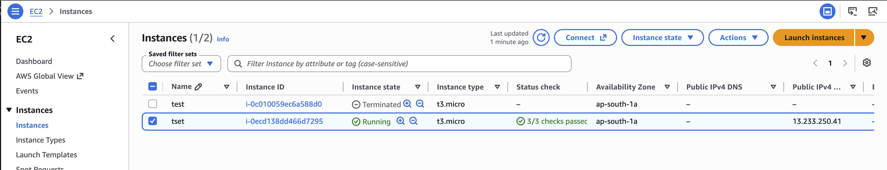
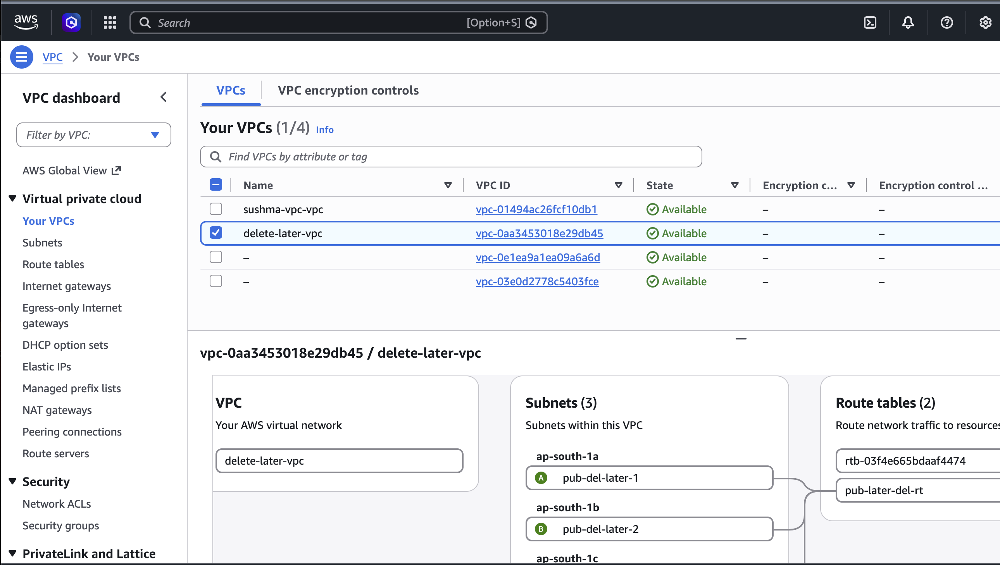
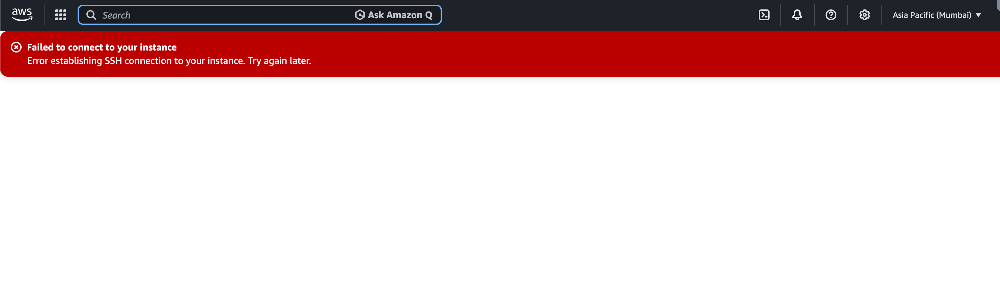
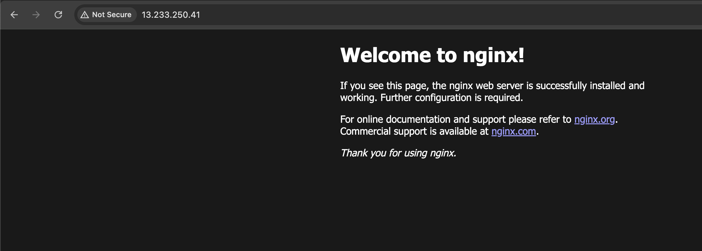
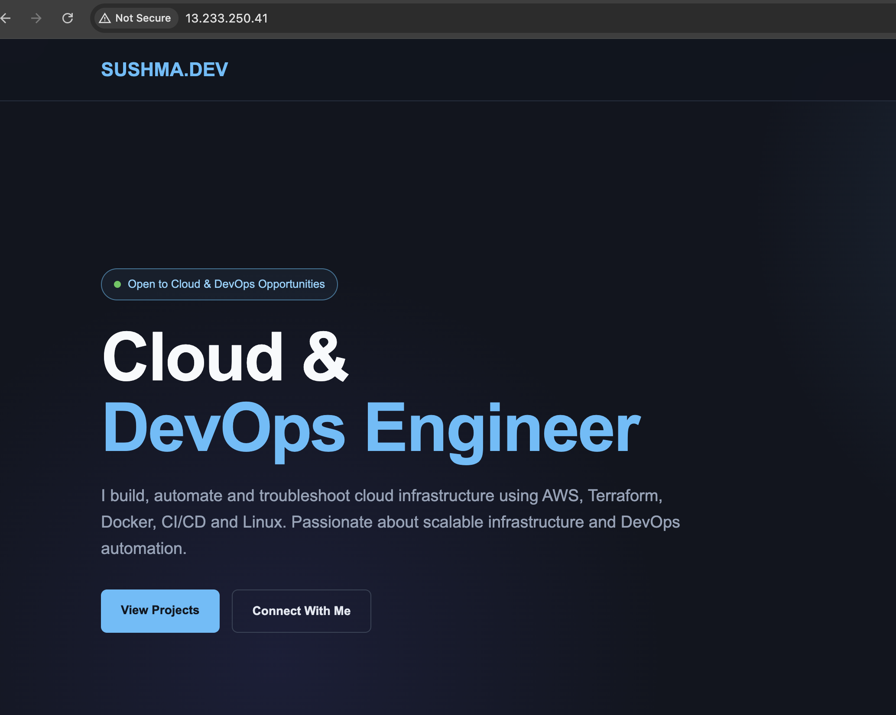

# AWS VPC + EC2 + NGINX Web Server Lab

## Project Overview

This is a hands-on AWS and Linux learning project focused on understanding basic cloud networking, EC2 connectivity, and NGINX web server deployment.

The objective was to create a VPC network, launch an EC2 instance, install NGINX, host a custom HTML webpage, and access the webpage through the EC2 public IP address.

---

## AWS Services & Technologies Used

* Amazon VPC
* Subnet
* Route Table
* Internet Gateway
* Security Group
* Amazon EC2
* NGINX
* Linux / Ubuntu
* HTML

---

## What I Practiced

1. Created an Amazon VPC.

2. Created a subnet inside the VPC.

3. Created a route table.

4. Created an Internet Gateway.

5. Attached the Internet Gateway to the VPC.

6. Added an internet route:

   `0.0.0.0/0 → Internet Gateway`

7. Associated the subnet with the route table.

8. Created an EC2 instance inside the subnet.

9. Troubleshot an EC2 SSH connection issue by checking the Security Group inbound rules.

10. Connected to the EC2 instance successfully.

11. Switched to the root user:

`sudo su -`

12. Updated Ubuntu packages:

`apt update`

13. Installed NGINX:

`apt install nginx -y`

14. Verified the NGINX service status:

`systemctl status nginx`

15. Navigated to the NGINX web directory:

`/var/www/html`

16. Created and modified the webpage using `vi`.
17. Accessed the NGINX webpage through the EC2 public IP.
18. Updated the webpage with a custom design and verified the changes.

---

## Architecture Flow

```text
                         🌐 Internet
                              |
                              v
                    ┌──────────────────┐
                    │ Internet Gateway │
                    └──────────────────┘
                              |
                              v
                    ┌──────────────────┐
                    │       VPC        │
                    │   10.0.0.0/16    │
                    └──────────────────┘
                              |
                              v
                    ┌──────────────────┐
                    │  Public Subnet   │
                    └──────────────────┘
                              |
                 ┌────────────┴────────────┐
                 |                         |
              contains                 associated with
                 |                         |
                 v                         v
        ┌──────────────────┐      ┌─────────────────────┐
        │  EC2 Instance    │      │    Route Table      │
        │    Public IP     │      │  0.0.0.0/0 → IGW    │
        └──────────────────┘      └─────────────────────┘
                 |
                 v
          ┌─────────────┐
          │    NGINX    │
          │ Web Server  │
          └─────────────┘
                 |
                 v
      /var/www/html/index.html
                 |
                 v
          🖥️ Custom Webpage
```

### Simple Request Flow

```text
Browser
   ↓
Internet
   ↓
Internet Gateway
   ↓
VPC
   ↓
Public Subnet
   ↓
EC2 Instance
   ↓
NGINX
   ↓
/var/www/html/index.html
   ↓
Custom Webpage
```

### How the Architecture Works

* **VPC** → Provides the isolated AWS network environment.
* **Public Subnet** → Provides a subnet inside the VPC where the EC2 instance is launched.
* **Route Table** → Is associated with the Public Subnet and contains the route `0.0.0.0/0 → Internet Gateway`.
* **Internet Gateway** → Provides connectivity between the VPC and the internet.
* **EC2 Instance** → Runs Ubuntu and hosts the NGINX web server.
* **Public IP** → Allows the webpage to be accessed from the internet.
* **Security Group** → Acts as a virtual firewall and controls allowed traffic to and from the EC2 instance.
* **NGINX** → Receives HTTP requests and serves the webpage.
* **`/var/www/html/index.html`** → Contains the HTML webpage served by NGINX.

> **Important:** The Route Table is not a network hop. It is associated with the subnet and determines where network traffic should be routed.

---

## Networking Flow

The **VPC** provides the isolated network environment.

The **Public Subnet** provides a network segment inside the VPC.

The **Internet Gateway** provides connectivity between the VPC and the internet.

The **Route Table** is associated with the Public Subnet and contains the internet route:

`0.0.0.0/0 → Internet Gateway`

The **EC2 instance** was launched inside the Public Subnet and configured with a public IP address so that it could be accessed from the internet.

The **Security Group** controls inbound and outbound traffic to the EC2 instance.

For this lab, SSH and HTTP access were configured so that I could connect to the server and access the NGINX webpage.

In a production environment, SSH access should normally be restricted to trusted IP addresses rather than being broadly exposed to the internet.

---

## NGINX Deployment

After connecting to the Ubuntu EC2 instance, I installed NGINX and verified that the service was running.

```bash
sudo su -
apt update
apt install nginx -y
systemctl status nginx
```

The default NGINX webpage was then accessed through the EC2 public IP.

The website files were located under:

```text
/var/www/html
```

I modified the webpage using:

```bash
vi /var/www/html/index.html
```

After updating the HTML, I refreshed the browser and verified that the custom webpage was successfully served by NGINX.

---

## Troubleshooting

### EC2 SSH Connection Issue

During the lab, the initial SSH connection attempt failed with an error establishing the SSH connection.

I investigated the EC2 Security Group inbound rules and corrected the required connectivity configuration.

After making the required Security Group changes, I was able to connect to the EC2 instance successfully.

This helped me understand that EC2 connectivity depends not only on the instance itself, but also on the surrounding network configuration and Security Group rules.

In production environments, SSH access should normally be restricted to trusted IP addresses rather than being broadly exposed to the internet.

---

## Screenshots

### 01 — EC2 Instance



### 02 — VPC Resource Map



### 03 — SSH Connection Troubleshooting



### 04 — NGINX Default Page



### 05 — NGINX Custom Page



---

## Key Learnings

Through this hands-on lab, I strengthened my understanding of:

* AWS VPC fundamentals
* Subnets
* Route tables
* Internet Gateway
* Security Groups
* EC2 networking
* Public IP addressing
* SSH connectivity
* Linux server administration
* NGINX installation and management
* Basic HTML deployment
* Troubleshooting AWS connectivity issues

---

## Cleanup

After completing the hands-on practice and capturing the required screenshots, the AWS resources were deleted to avoid unnecessary ongoing AWS charges.

---

## Project Type

**Hands-on Personal Learning Project**

This project was created to strengthen practical AWS, Linux, networking, and NGINX fundamentals through hands-on implementation and troubleshooting.

