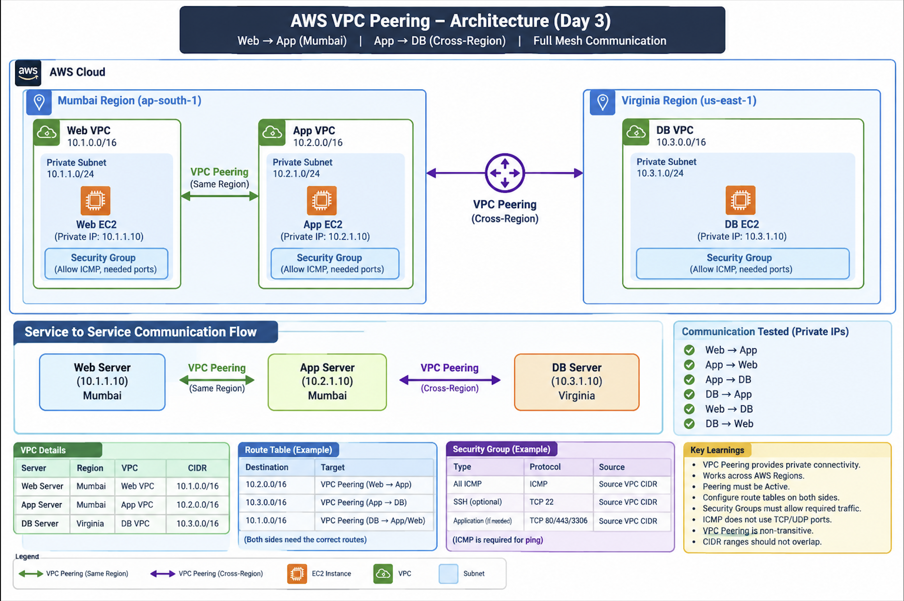
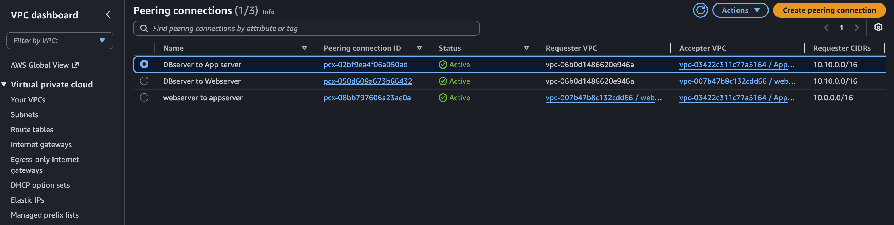
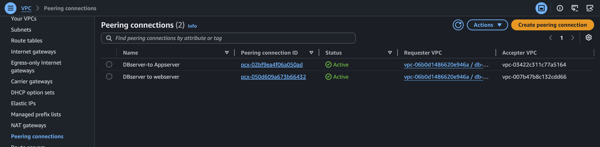
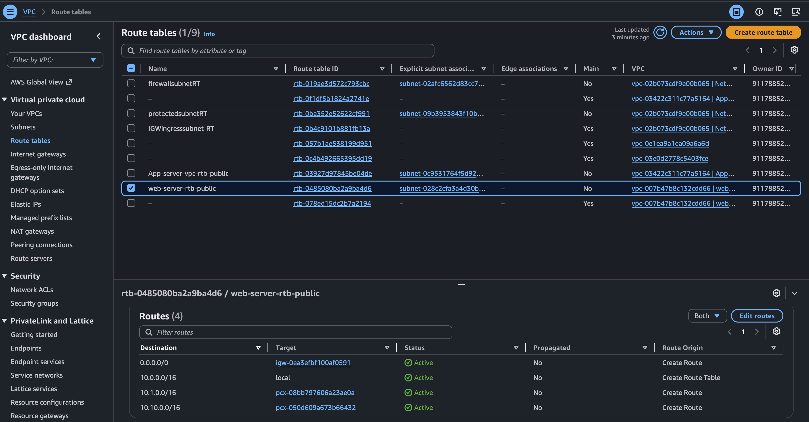
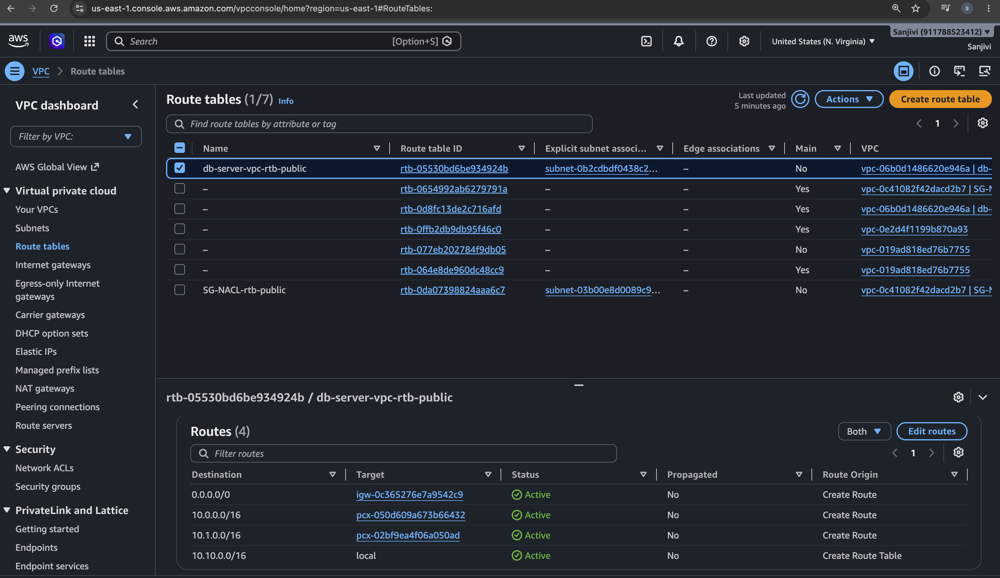
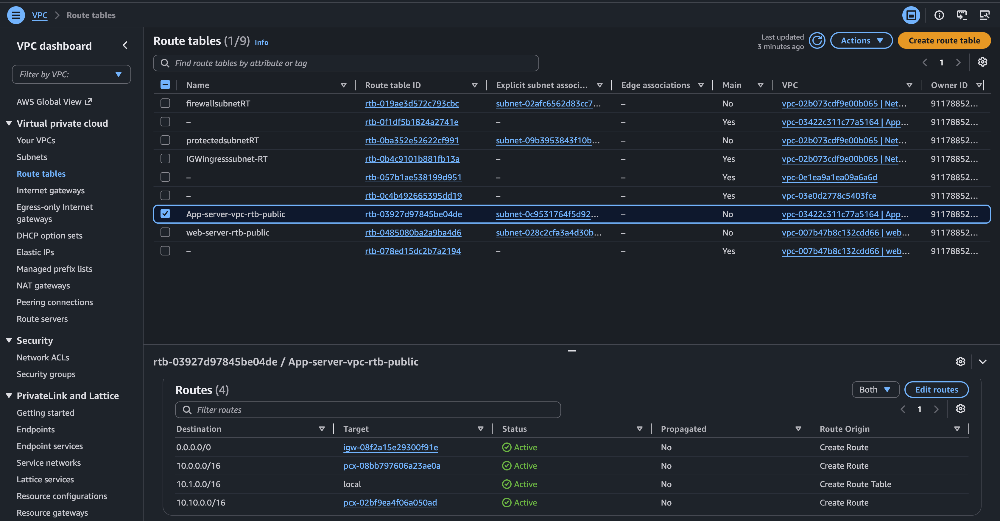
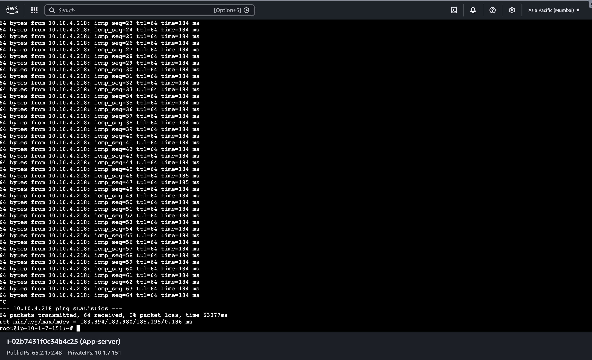
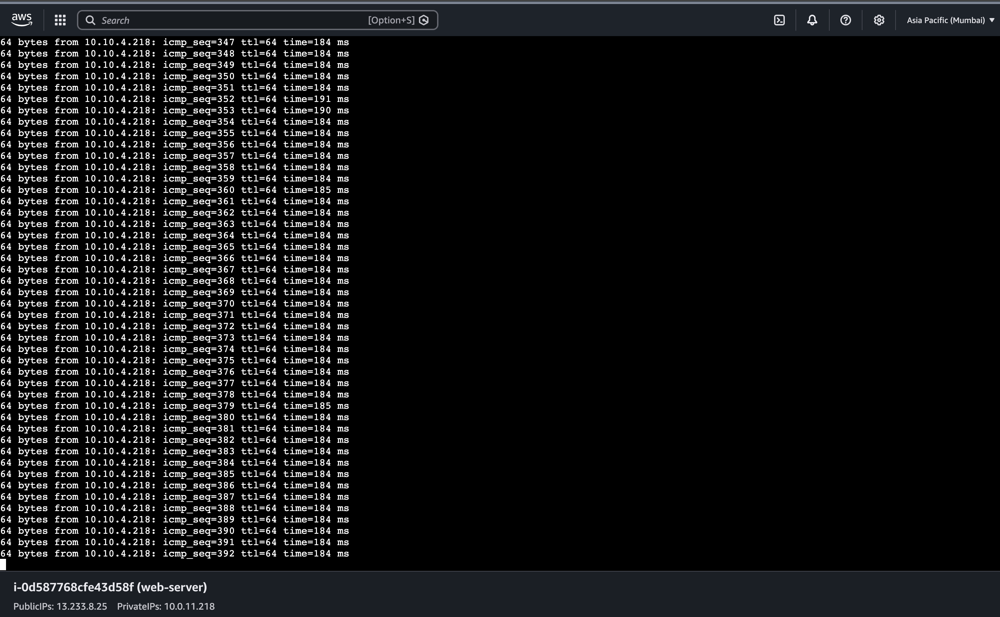
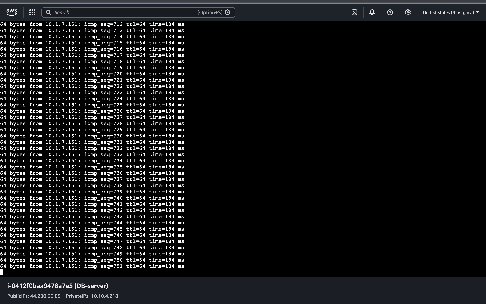

# Day 3 — AWS VPC Peering Hands-On

## 📌 Project Overview

On Day 3, I performed a hands-on AWS VPC Peering project to understand how resources in different VPCs can communicate with each other using **private IP addresses**.

I created:

* **2 VPCs in Mumbai (`ap-south-1`)**

  * Web VPC
  * App VPC
* **1 VPC in Virginia (`us-east-1`)**

  * DB VPC

I launched EC2 instances in these VPCs and configured **VPC Peering, Route Tables, and Security Groups** to establish private network connectivity.

I tested connectivity between the Web, App, and DB servers using `ping`.

---

## 🏗️ AWS VPC Peering Architecture Diagram



### Architecture Flow

```text
                         AWS VPC PEERING ARCHITECTURE

                         MUMBAI REGION
                          ap-south-1

                    ┌─────────────────────┐
                    │      WEB VPC        │
                    │    10.0.0.0/16      │
                    │                     │
                    │   Web EC2 Server    │
                    │   10.0.11.218       │
                    └─────────┬───────────┘
                              │
                    VPC Peering Connection
                              │
                              ▼
                    ┌─────────────────────┐
                    │      APP VPC        │
                    │    10.1.0.0/16      │
                    │                     │
                    │   App EC2 Server    │
                    │    10.1.7.151       │
                    └─────────┬───────────┘
                              │
                    VPC Peering Connection
                              │
                              ▼

                         VIRGINIA REGION
                           us-east-1

                    ┌─────────────────────┐
                    │       DB VPC        │
                    │   10.10.0.0/16      │
                    │                     │
                    │    DB EC2 Server    │
                    │    10.10.4.218      │
                    └─────────────────────┘


        Web VPC ───────── VPC Peering ───────── DB VPC
        10.0.0.0/16                         10.10.0.0/16
```

### Communication Tested

```text
Web Server  ───────────────► App Server
App Server  ───────────────► Web Server

App Server  ───────────────► DB Server
DB Server   ───────────────► App Server

Web Server  ───────────────► DB Server
DB Server   ───────────────► Web Server
```

All connectivity was tested using **private IP addresses**.

---

## 🎯 Objective

The main objectives of this hands-on were:

* Understand AWS VPC Peering
* Connect multiple VPCs using private networking
* Understand Route Tables for VPC Peering
* Configure Security Groups for ICMP traffic
* Test private IP connectivity between EC2 instances
* Understand cross-region VPC Peering
* Troubleshoot network connectivity issues

---

## 🌎 AWS Regions Used

| Region                 | Purpose             |
| ---------------------- | ------------------- |
| Mumbai (`ap-south-1`)  | Web VPC and App VPC |
| Virginia (`us-east-1`) | DB VPC              |

---

# 🖥️ Infrastructure Created

## 1. Web VPC

* Region: Mumbai (`ap-south-1`)
* CIDR: `10.0.0.0/16`
* EC2: Web Server
* Private IP: `10.0.11.218`

## 2. App VPC

* Region: Mumbai (`ap-south-1`)
* CIDR: `10.1.0.0/16`
* EC2: App Server
* Private IP: `10.1.7.151`

## 3. DB VPC

* Region: Virginia (`us-east-1`)
* CIDR: `10.10.0.0/16`
* EC2: DB Server
* Private IP: `10.10.4.218`

---

# 🔗 VPC Peering Configuration

I created VPC Peering connections between the required VPCs so that the EC2 instances could communicate using **private IP addresses**.

The peering connections were configured between:

* Web VPC ↔ App VPC
* App VPC ↔ DB VPC
* Web VPC ↔ DB VPC

The required peering connections were successfully established and became **Active**.

---

# 🛣️ Route Table Configuration

VPC Peering alone does not automatically provide connectivity.

I added routes in the appropriate Route Tables so traffic destined for the remote VPC CIDR would use the corresponding **VPC Peering Connection** as the target.

## Web VPC

Route to App VPC:

```text
Destination: 10.1.0.0/16
Target: VPC Peering Connection
```

Route to DB VPC:

```text
Destination: 10.10.0.0/16
Target: VPC Peering Connection
```

## App VPC

Route to Web VPC:

```text
Destination: 10.0.0.0/16
Target: VPC Peering Connection
```

Route to DB VPC:

```text
Destination: 10.10.0.0/16
Target: VPC Peering Connection
```

## DB VPC

Route to App VPC:

```text
Destination: 10.1.0.0/16
Target: VPC Peering Connection
```

Route to Web VPC:

```text
Destination: 10.0.0.0/16
Target: VPC Peering Connection
```

---

# 🔐 Security Group Configuration

The EC2 Security Groups needed to allow the required traffic.

For connectivity testing, I allowed:

```text
Type: All ICMP - IPv4
```

The source was configured using the appropriate remote VPC CIDR.

Example:

```text
Source: 10.1.0.0/16
```

This allowed the Web VPC resources to send ICMP traffic to the App VPC.

Similar ICMP rules were configured for the required VPC-to-VPC communication.

---

# 🧪 Connectivity Testing

After configuring VPC Peering, Route Tables, and Security Groups, I tested connectivity using the `ping` command.

## Web → App

```bash
ping 10.1.7.151
```

**Result:** Successful ✅

## App → Web

```bash
ping 10.0.11.218
```

**Result:** Successful ✅

## App → DB

```bash
ping 10.10.4.218
```

**Result:** Successful ✅

## DB → App

```bash
ping 10.1.7.151
```

**Result:** Successful ✅

## Web → DB

```bash
ping 10.10.4.218
```

**Result:** Successful ✅

## DB → Web

```bash
ping 10.0.11.218
```

**Result:** Successful ✅

All required connectivity tests were successfully completed.

---

# 🛠️ Troubleshooting

## Problem: Ping Was Initially Failing

During connectivity testing, `ping` initially failed between the servers.

I checked:

1. VPC Peering connection status
2. Route Table configuration
3. Security Group configuration

The VPC Peering connections were active, but the required **ICMP traffic was not properly allowed in the Security Group**.

### Fix

I updated the Security Group to allow:

```text
Type: All ICMP - IPv4
```

from the required remote VPC CIDR.

After updating the Security Group, I tested the connectivity again.

The `ping` requests were successful.

### What I Learned

A VPC Peering connection being **Active** does not automatically mean that EC2 instances can communicate.

The network path requires the appropriate configuration:

```text
Source EC2
    ↓
Route Table
    ↓
VPC Peering Connection
    ↓
Destination VPC
    ↓
Destination Security Group
    ↓
Destination EC2
```

All required network controls must allow the traffic.

---

# 🔄 End-to-End Network Flow

The project used private IP communication between EC2 instances in different VPCs.

```text
                         MUMBAI
                       ap-south-1

                  ┌─────────────────┐
                  │     Web VPC     │
                  │  10.0.0.0/16    │
                  │                 │
                  │   Web Server    │
                  │  10.0.11.218    │
                  └────────┬────────┘
                           │
                           │ VPC Peering
                           │
                           ▼
                  ┌─────────────────┐
                  │     App VPC     │
                  │  10.1.0.0/16    │
                  │                 │
                  │   App Server    │
                  │  10.1.7.151     │
                  └────────┬────────┘
                           │
                           │ VPC Peering
                           │
                           ▼
                       VIRGINIA
                       us-east-1

                  ┌─────────────────┐
                  │     DB VPC      │
                  │ 10.10.0.0/16    │
                  │                 │
                  │    DB Server    │
                  │  10.10.4.218    │
                  └─────────────────┘
```

### Direct Web ↔ DB Connectivity

The Web VPC also had a direct VPC Peering connection with the DB VPC for the tested Web-to-DB and DB-to-Web communication.

```text
Web VPC
10.0.0.0/16
     │
     │ Direct VPC Peering
     │
     ▼
DB VPC
10.10.0.0/16
```

The communication used **private IP addresses**, not public IP addresses.

---

# ⚠️ Important Concept — VPC Peering Is Non-Transitive

VPC Peering is **non-transitive**.

For example:

```text
VPC A ←→ VPC B ←→ VPC C
```

does not automatically mean:

```text
VPC A ←→ VPC C
```

through VPC B.

VPC B cannot act as a router between VPC A and VPC C.

If VPC A needs direct communication with VPC C, a **direct VPC Peering connection** or another appropriate networking solution is required.

In this project, the required direct peering connections were configured for the connectivity that I tested.

---

# 📸 Screenshots

## 1. VPC Peering Topology



## 2. DB VPC Peering Connections



## 3. Web VPC Route to App VPC



## 4. DB VPC Route to App VPC



## 5. App VPC Routes to Web and DB



## 6. App Server to DB Server Ping



## 7. Web to DB Connectivity



## 8. DB to App Connectivity



---

# 📚 Key Learnings

Through this hands-on project, I learned:

* What AWS VPC Peering is
* How VPCs communicate using private IP addresses
* How to connect VPCs in the same AWS Region
* How to configure cross-region VPC Peering
* How to accept and activate a VPC Peering connection
* How Route Tables control traffic between VPCs
* How Security Groups control instance-level traffic
* How ICMP is used by `ping`
* How to troubleshoot failed network connectivity
* Why VPC Peering is non-transitive
* How to verify private network connectivity between EC2 instances

---

# 💰 Cost Management

To avoid unnecessary AWS charges, I cleaned up the AWS resources after completing the hands-on and capturing the required screenshots.

The resources were deleted after testing.

---

# ✅ Project Result

The VPC Peering setup was successfully completed.

I established private connectivity between the Web, App, and DB VPC environments and successfully tested communication using private IP addresses.

I also gained practical troubleshooting experience by identifying and fixing an **ICMP Security Group configuration issue**.

---

# 🏁 Conclusion

This hands-on helped me understand how AWS VPC Peering works in a real-world networking scenario.

I learned that successful communication between VPCs requires more than simply creating a peering connection. The **VPC Peering connection, Route Tables, and Security Groups** must all be correctly configured.

This project strengthened my understanding of **AWS networking, private connectivity, cross-region communication, and troubleshooting** from a DevOps perspective.

