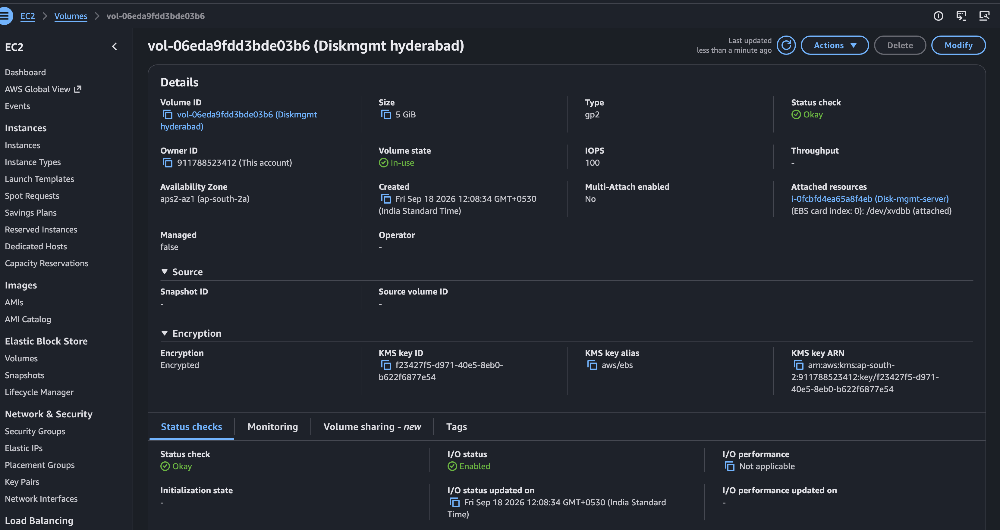
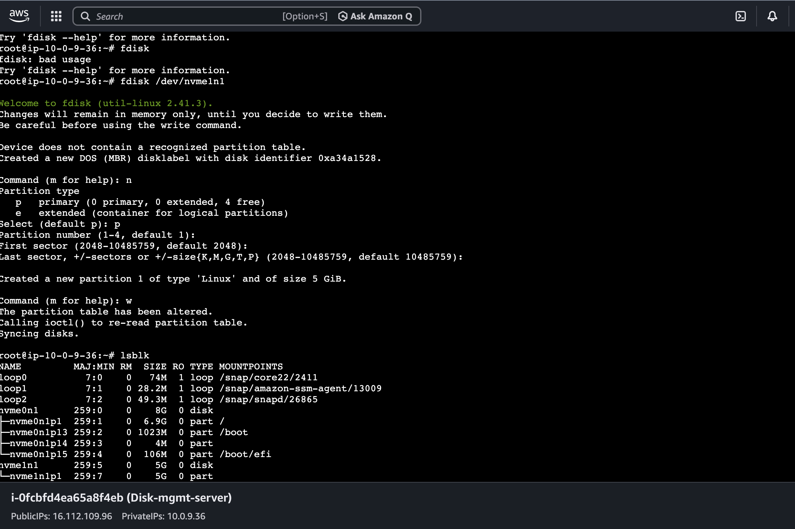
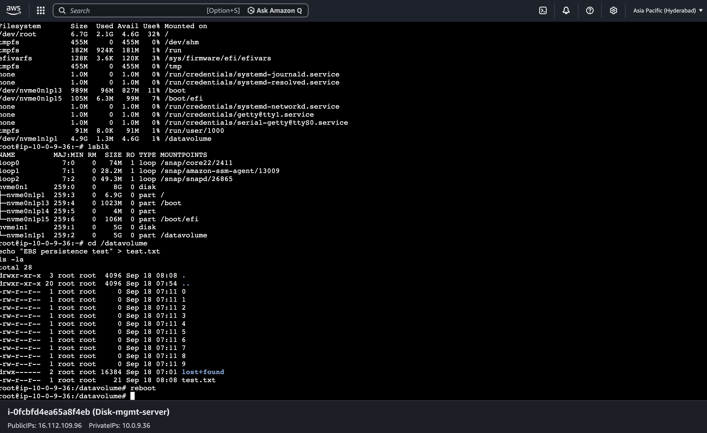
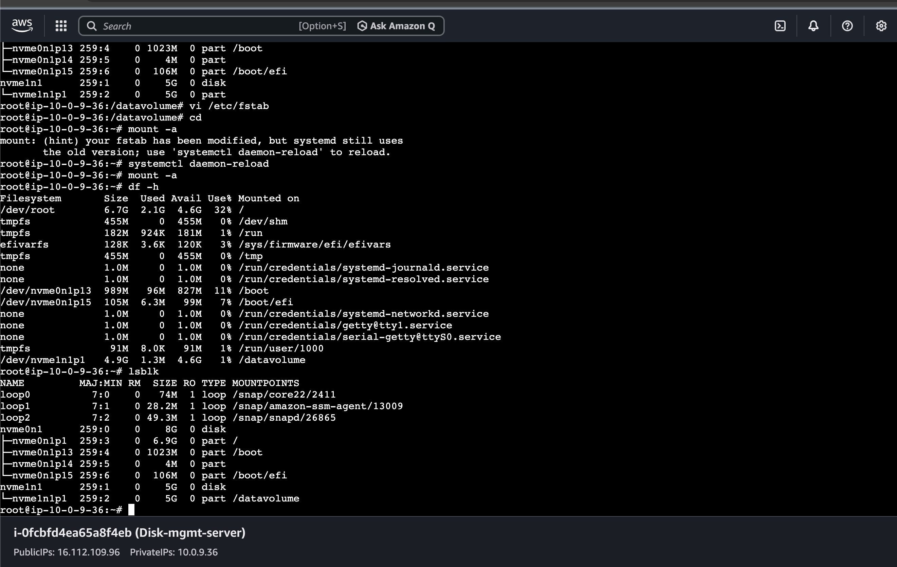
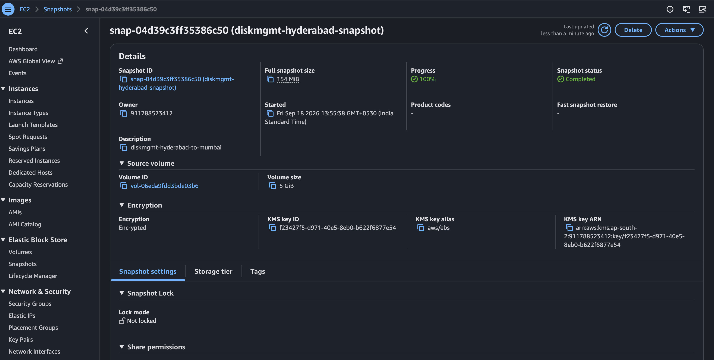
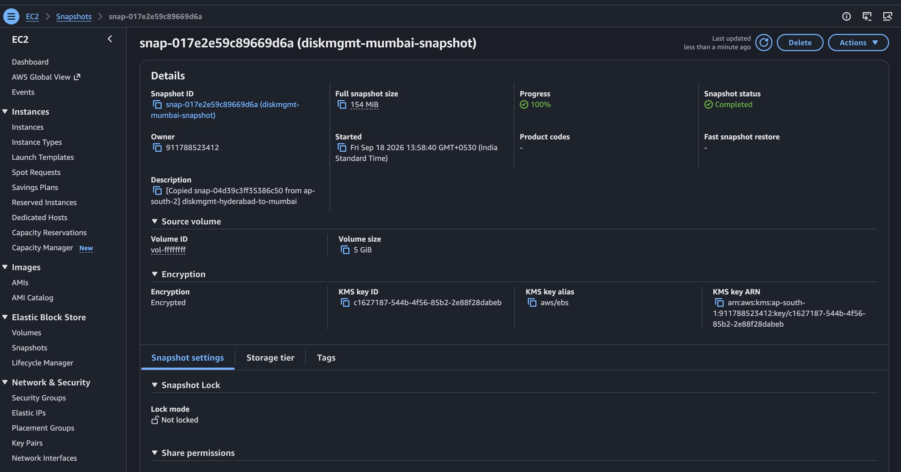
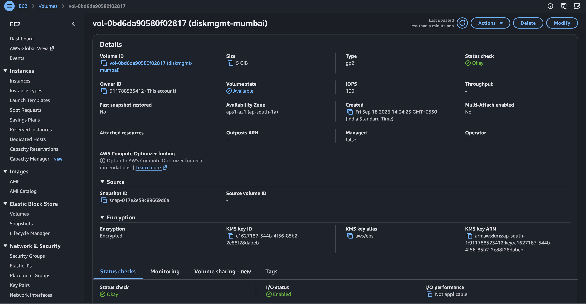

# Day 5 — AWS EBS Disk Management & Cross-Region Snapshot

## 📌 Overview

On Day 5, I performed a hands-on AWS EBS (Elastic Block Store) lab to understand how persistent block storage works with Amazon EC2.

I practiced:

* Creating and attaching an EBS volume to EC2
* Identifying the attached disk in Linux
* Understanding AWS device names vs Linux NVMe device names
* Partitioning an EBS volume
* Creating an ext4 filesystem
* Mounting the filesystem
* Using `lsblk`, `blkid`, and `df -h`
* Using UUID for persistent mounting
* Configuring `/etc/fstab`
* Testing filesystem persistence
* Creating an EBS snapshot
* Copying the snapshot from Hyderabad (`ap-south-2`) to Mumbai (`ap-south-1`)
* Creating a new EBS volume from the copied snapshot
* Troubleshooting Linux disk and mount configuration

All resources were deleted after completing the lab to avoid unnecessary AWS charges.

---

# 1. Architecture / Flow

```text
                    AWS EC2
                       │
                       │ Attach
                       ▼
                EBS Volume (5 GiB)
                       │
                       ▼
                 Linux Device
                  /dev/nvme1n1
                       │
                       ▼
                Partition
               /dev/nvme1n1p1
                       │
                       ▼
                 ext4 Filesystem
                       │
                       ▼
                  /datavolume
                       │
                       ▼
                 /etc/fstab
                       │
                       ▼
              Automatic Mount
                 after reboot


Cross-Region Flow:

Hyderabad
ap-south-2
    │
    ▼
EBS Volume
    │
    ▼
EBS Snapshot
    │
    ▼
Copy Snapshot
    │
    ▼
Mumbai
ap-south-1
    │
    ▼
Copied Snapshot
    │
    ▼
New EBS Volume
```

---

# 2. AWS Environment

| Component                | Details            |
| ------------------------ | ------------------ |
| EC2 Name                 | `disk-mgmt-server` |
| Instance Type            | `t3.micro`         |
| Source Region            | `ap-south-2`       |
| Source Availability Zone | `ap-south-2a`      |
| EBS Size                 | 5 GiB              |
| Volume Type              | gp2                |
| Filesystem               | ext4               |
| Mount Point              | `/datavolume`      |
| Destination Region       | `ap-south-1`       |

---

# 3. Step 1 — Created the EBS Volume

I created an additional **5 GiB EBS volume** in the same Availability Zone as the EC2 instance.

The EBS volume was:

* 5 GiB
* gp2
* Created in `ap-south-2a`
* Encrypted using the AWS-managed EBS KMS key
* Tagged as `diskmgmt`

The important point is that an EBS volume must be in the **same Availability Zone** as the EC2 instance when attaching it.

### Screenshot



---

# 4. Step 2 — Attached EBS Volume to EC2

I attached the EBS volume to the EC2 instance using the AWS Console.

The device name selected in the AWS Console was:

```text
/dev/xvdb
```

However, inside the Ubuntu EC2 instance, Linux identified the disk as:

```text
/dev/nvme1n1
```

This happens because Nitro-based EC2 instances expose EBS volumes through the NVMe interface.

I verified the actual Linux device using:

```bash
lsblk
```

---

# 5. Step 3 — Checked the Disk Using lsblk

I used:

```bash
lsblk
```

to identify the newly attached EBS disk.

The disk appeared as:

```text
nvme1n1    5G
```

At this point, it was a raw disk without a usable filesystem.

### What is a Raw Disk?

A raw disk is a newly attached block device that has not yet been prepared with a filesystem for normal file storage.

---

# 6. Step 4 — Partitioned the EBS Disk

I used `fdisk` to create a partition.

Command:

```bash
sudo fdisk /dev/nvme1n1
```

I created a primary partition.

The resulting partition was:

```text
/dev/nvme1n1p1
```

### Screenshot



---

# 7. Step 5 — Created an ext4 Filesystem

After creating the partition, I formatted it with the ext4 filesystem.

Command:

```bash
sudo mkfs.ext4 /dev/nvme1n1p1
```

### Why ext4?

`ext4` is a commonly used Linux filesystem.

Formatting prepares the partition so Linux can store files and directories on it.

---

# 8. Step 6 — Checked the UUID

I used:

```bash
sudo blkid /dev/nvme1n1p1
```

This returns information such as:

```text
UUID="xxxxxxxx-xxxx-xxxx-xxxx-xxxxxxxxxxxx"
TYPE="ext4"
```

### What is UUID?

UUID means **Universally Unique Identifier**.

The UUID identifies the filesystem.

Instead of depending only on a device name such as:

```text
/dev/nvme1n1p1
```

I used the UUID when configuring `/etc/fstab`.

### Why use UUID?

Device names can potentially change depending on how devices are detected.

UUID provides a stable way to identify the filesystem.

> Note: I performed the UUID step during the lab, but I did not retain a separate screenshot for it.

---

# 9. Step 7 — Created a Mount Point

I created the directory:

```bash
sudo mkdir /datavolume
```

This directory became the mount point for the EBS filesystem.

### What is a Mount Point?

A mount point is a directory through which Linux provides access to a mounted filesystem.

In this lab:

```text
EBS Volume
    ↓
Partition
    ↓
ext4 filesystem
    ↓
/datavolume
```

---

# 10. Step 8 — Mounted the EBS Filesystem

I mounted the partition:

```bash
sudo mount /dev/nvme1n1p1 /datavolume
```

Then I verified it using:

```bash
df -h
```

and:

```bash
lsblk
```

The output showed:

```text
nvme1n1
└─nvme1n1p1    /datavolume
```

### Screenshot



---

# 11. Step 9 — Configured /etc/fstab

A manually mounted filesystem may not automatically be mounted after a reboot.

Therefore, I configured `/etc/fstab` so Linux can automatically mount the filesystem during boot.

I edited:

```bash
sudo vi /etc/fstab
```

I configured the filesystem using its UUID.

General format:

```text
UUID=<filesystem-uuid>  /datavolume  ext4  defaults,nofail  0  2
```

### Important Understanding

`/etc/fstab` does **not** make EBS persistent.

EBS is already persistent storage.

`/etc/fstab` makes the filesystem **automatically mount** during boot.

---

# 12. Step 10 — Reloaded Mount Configuration

After editing `/etc/fstab`, I used:

```bash
sudo systemctl daemon-reload
```

Then:

```bash
sudo mount /datavolume
```

I verified the mount using:

```bash
df -h
```

and:

```bash
lsblk
```

The filesystem was mounted at:

```text
/datavolume
```

### Screenshot



---

# 13. Step 11 — Tested Data Persistence

I created test files inside:

```text
/datavolume
```

For example:

```bash
cd /datavolume
touch "EBS persistence test test.txt"
ls
```

This verified that the mounted EBS filesystem could store data.

The storage flow was:

```text
EC2
 │
 └── EBS Volume
       │
       └── Partition
             │
             └── ext4 Filesystem
                    │
                    └── /datavolume
                           │
                           └── Test Files
```

---

# 14. EBS Persistence

One important concept I learned is that **EBS is persistent block storage**.

EBS is separate from the temporary running state of the EC2 instance.

The data stored on an EBS volume is designed to persist independently of the instance's running state.

### Important distinction

```text
EBS
→ Persistent storage

/etc/fstab
→ Automatic filesystem mounting
```

`/etc/fstab` does not make the EBS volume persistent. It tells Linux how to mount the filesystem automatically.

---

# 15. Step 12 — Created an EBS Snapshot

After completing the disk management exercise, I created an EBS snapshot.

Source:

```text
Region: ap-south-2
Availability Zone: ap-south-2a
```

Snapshot:

```text
diskmgmt-hyderabad-snapshot
```

Source volume:

```text
vol-06eda9fdd3bde03b6
```

### Screenshot



---

# 16. What is an EBS Snapshot?

An EBS snapshot is a **point-in-time backup of an EBS volume**.

Snapshots can be used for:

* Data backup
* Disaster recovery
* Creating new EBS volumes
* Copying storage data between AWS Regions
* Creating additional volumes

---

# 17. Step 13 — Copied Snapshot to Mumbai

I copied the snapshot from:

```text
Source Region:
ap-south-2
Hyderabad
```

to:

```text
Destination Region:
ap-south-1
Mumbai
```

The copied snapshot was:

```text
diskmgmt-mumbai-snapshot
```

The copied snapshot reached:

```text
100%
```

### Screenshot



---

# 18. Step 14 — Created a New EBS Volume in Mumbai

From the copied snapshot, I created a new EBS volume in Mumbai.

Destination:

```text
Region: ap-south-1
Availability Zone: ap-south-1a
```

New volume:

```text
diskmgmt-mumbai
```

Volume ID:

```text
vol-0bd6da90580f02817
```

Size:

```text
5 GiB
```

State:

```text
Available
```

### Screenshot



---

# 19. Cross-Region EBS Migration Flow

The complete process was:

```text
                 HYDERABAD
                 ap-south-2
                     │
                     ▼
              EBS Volume 5 GiB
                     │
                     ▼
               EBS Snapshot
                     │
                     │ Copy Snapshot
                     ▼
                  MUMBAI
                 ap-south-1
                     │
                     ▼
              Copied Snapshot
                     │
                     ▼
             New EBS Volume
```

### Important Concept

An EBS volume is **Availability Zone scoped**.

It cannot be directly attached across AWS Regions.

For cross-Region movement:

```text
EBS Volume
    ↓
Snapshot
    ↓
Copy Snapshot to Destination Region
    ↓
Create EBS Volume
    ↓
Attach to EC2 in Destination AZ
```

---

# 20. Troubleshooting I Faced

## Issue 1 — AWS Device Name vs Linux Device Name

### Problem

I attached the volume using:

```text
/dev/xvdb
```

but Linux showed:

```text
/dev/nvme1n1
```

### Investigation

I ran:

```bash
lsblk
```

### Resolution

I identified the actual Linux device:

```text
/dev/nvme1n1
```

and used that device for partitioning.

### Lesson

Always verify the actual device inside Linux instead of assuming the AWS Console device name will be identical.

---

## Issue 2 — Disk Was Not Immediately Usable

### Problem

After attaching the EBS volume, the disk appeared as a block device but was not ready for normal file storage.

### Reason

The new disk needed to be prepared.

The process was:

```text
Raw Disk
   ↓
Partition
   ↓
Filesystem
   ↓
Mount Point
   ↓
Usable Storage
```

### Commands Used

```bash
lsblk
```

```bash
sudo fdisk /dev/nvme1n1
```

```bash
sudo mkfs.ext4 /dev/nvme1n1p1
```

```bash
sudo mkdir /datavolume
```

```bash
sudo mount /dev/nvme1n1p1 /datavolume
```

---

## Issue 3 — Automatic Mount Configuration

### Problem

A manually mounted filesystem does not automatically become mounted after every reboot.

### Resolution

I configured `/etc/fstab` using the filesystem UUID.

Example:

```text
UUID=<filesystem-uuid> /datavolume ext4 defaults,nofail 0 2
```

Then I verified the configuration using:

```bash
sudo mount /datavolume
```

and:

```bash
df -h
```

### Lesson

Using UUID in `/etc/fstab` provides a stable filesystem reference for automatic mounting.

---

# 21. Linux Commands Practiced

### List block devices

```bash
lsblk
```

### Check filesystem UUID

```bash
sudo blkid
```

### Check filesystem usage

```bash
df -h
```

### Partition disk

```bash
sudo fdisk /dev/nvme1n1
```

### Create ext4 filesystem

```bash
sudo mkfs.ext4 /dev/nvme1n1p1
```

### Create mount point

```bash
sudo mkdir /datavolume
```

### Mount filesystem

```bash
sudo mount /dev/nvme1n1p1 /datavolume
```

### Check mounted files

```bash
ls -lah /datavolume
```

### Reload system configuration

```bash
sudo systemctl daemon-reload
```

### Edit fstab

```bash
sudo vi /etc/fstab
```

---

# 22. Complete Hands-On Flow

```text
Create EBS Volume
        ↓
Attach EBS to EC2
        ↓
Identify Linux Device
        ↓
Partition Disk
        ↓
Create ext4 Filesystem
        ↓
Get UUID
        ↓
Create Mount Point
        ↓
Mount Filesystem
        ↓
Configure /etc/fstab
        ↓
Verify Mount
        ↓
Create Test Files
        ↓
Create EBS Snapshot
        ↓
Copy Snapshot to Mumbai
        ↓
Create New EBS Volume
```

---

# 23. What I Learned

Through this lab, I understood the complete EBS disk management workflow from the AWS layer to the Linux layer.

I learned how:

* AWS EBS provides persistent block storage for EC2.
* An attached EBS volume appears as a block device inside Linux.
* AWS device names can differ from Linux NVMe device names.
* A raw disk needs to be partitioned and formatted before normal use.
* `lsblk` helps identify disks, partitions, and mount points.
* `blkid` helps identify filesystem UUIDs.
* `df -h` helps verify mounted filesystem usage.
* UUID can be used in `/etc/fstab`.
* `/etc/fstab` enables automatic mounting during boot.
* EBS snapshots provide point-in-time backups.
* EBS snapshots can be copied between AWS Regions.
* A new EBS volume can be created from a copied snapshot in another Region.

---

# 24. Screenshots

| #  | Screenshot                                | Purpose                                 |
| -- | ----------------------------------------- | --------------------------------------- |
| 01 | `01-ebs-hyderabad-volume-attached.png`    | EBS volume attached to EC2              |
| 02 | `02-ebs-partition-fdisk.png`              | Disk partitioning                       |
| 03 | `03-ebs-lsblk-mount-persistence-test.png` | lsblk, mount and persistence test       |
| 04 | `04-ebs-fstab-auto-mount.png`             | `/etc/fstab` automatic mount            |
| 05 | `05-ebs-hyderabad-snapshot.png`           | Hyderabad EBS snapshot                  |
| 06 | `06-ebs-mumbai-copied-snapshot.png`       | Snapshot copied to Mumbai               |
| 07 | `07-ebs-mumbai-volume-from-snapshot.png`  | Mumbai EBS volume created from snapshot |

---

# 25. Cost-Safe Practice

After completing the hands-on practice and taking the required screenshots, I removed the AWS resources to avoid unnecessary charges.

This was a personal hands-on learning lab for AWS Cloud and DevOps practice.

---

## Technologies & Skills

* Amazon EC2
* Amazon EBS
* EBS Volumes
* EBS Snapshots
* Cross-Region Snapshot Copy
* Linux Disk Management
* `lsblk`
* `blkid`
* `df`
* `fdisk`
* ext4
* Mount Points
* `/etc/fstab`
* UUID
* AWS Regions
* AWS Availability Zones
* Storage Troubleshooting
* Persistent Storage
* Backup and Recovery Concepts

