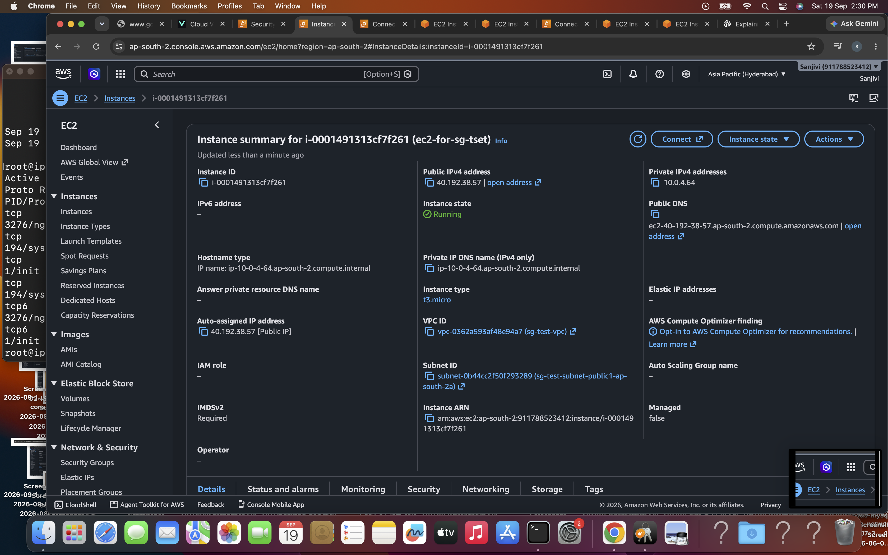
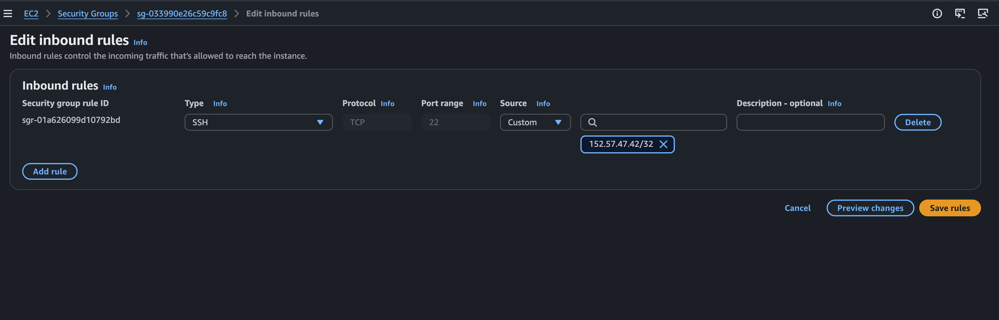
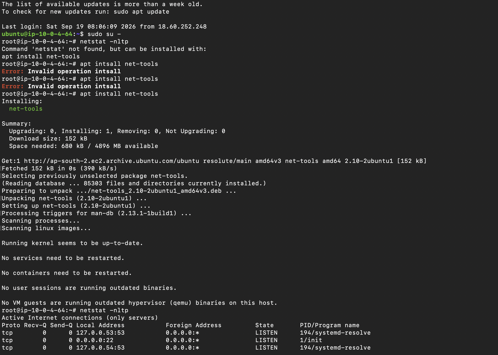
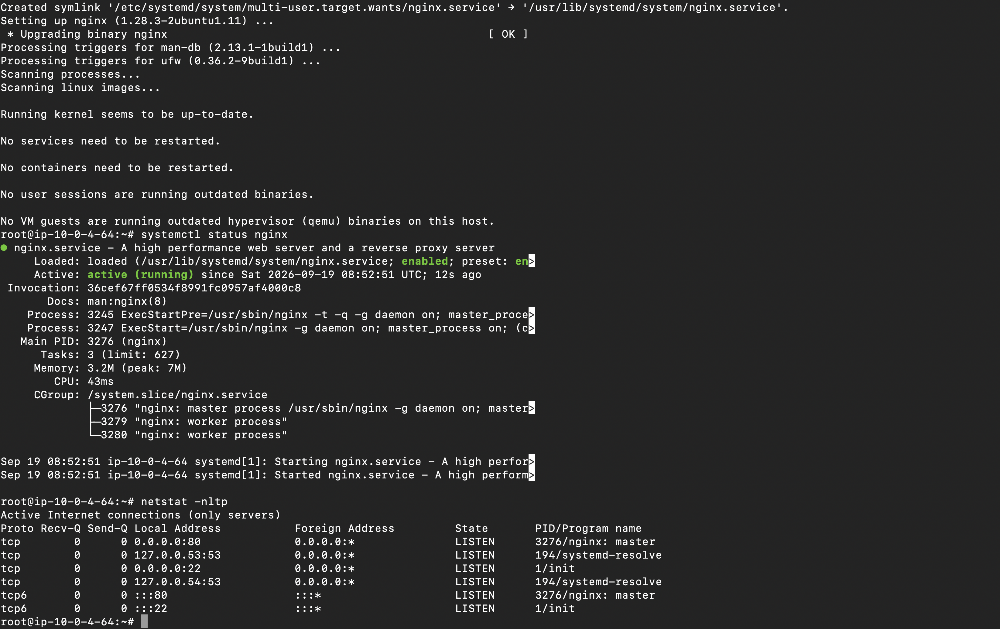
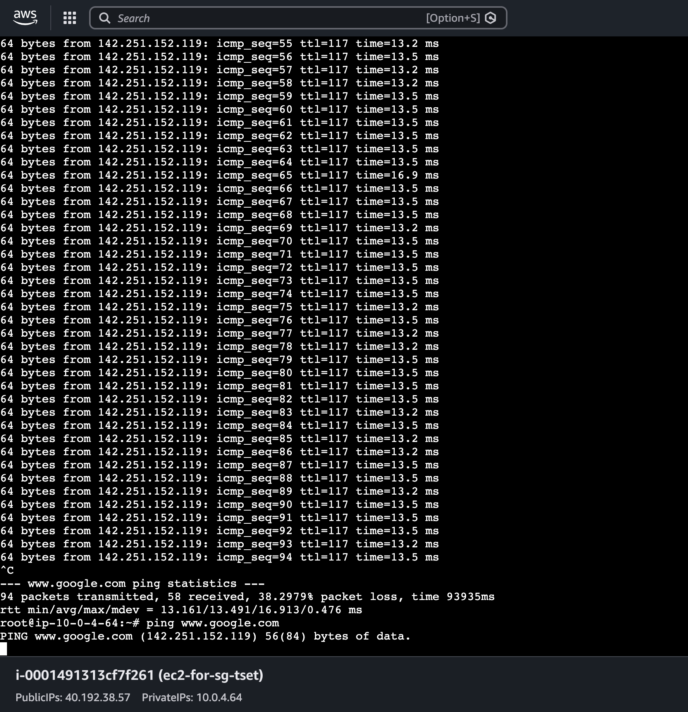

# AWS Security Group, NACL, Firewall & Network Ports Lab

## Project Overview

This hands-on lab focused on understanding AWS network security and basic network communication.

I learned about:

- Network protocols
- Network ports
- Firewalls
- Types of firewalls
- AWS Security Groups
- AWS Network ACLs (NACL)
- Stateful vs stateless firewalls
- SSH connectivity
- NGINX and HTTP port 80
- ICMP and network connectivity testing
- Basic network troubleshooting

For the practical implementation, I created an EC2 instance, configured Security Group rules, tested SSH connectivity, installed NGINX, checked listening ports using `netstat`, and tested internet connectivity using `ping`.

---

# Architecture

```text
                         INTERNET
                            |
                            |
                    ┌───────▼────────┐
                    │   My Laptop    │
                    │                │
                    │ Public IP      │
                    │ 152.57.47.42   │
                    └───────┬────────┘
                            |
                            | SSH
                            | TCP :22
                            ↓
                  ┌────────────────────┐
                  │ AWS Security Group │
                  │                    │
                  │ Inbound            │
                  │ TCP :22            │
                  │ My IP /32          │
                  │                    │
                  │ Outbound           │
                  │ Traffic            │
                  └─────────┬──────────┘
                            |
                            ↓
                 ┌─────────────────────┐
                 │       AWS VPC       │
                 │                     │
                 │   ┌─────────────┐   │
                 │   │    NACL     │   │
                 │   │             │   │
                 │   │  Inbound    │   │
                 │   │  Outbound   │   │
                 │   └──────┬──────┘   │
                 │          |          │
                 │          ↓          │
                 │   ┌─────────────┐   │
                 │   │ EC2 Instance│   │
                 │   │             │   │
                 │   │ Ubuntu      │   │
                 │   │             │   │
                 │   │ TCP :22     │   │
                 │   │ SSH         │   │
                 │   │             │   │
                 │   │ TCP :80     │   │
                 │   │ NGINX       │   │
                 │   └──────┬──────┘   │
                 │          |          │
                 └──────────┼──────────┘
                            |
                            | ICMP
                            ↓
                         INTERNET
                            |
                            ↓
                     www.google.com
```

### Simple Architecture Flow

```text
My Laptop
    ↓
Security Group
    ↓
NACL
    ↓
Subnet
    ↓
EC2
    ↓
NGINX :80
```

For internet connectivity testing:

```text
EC2
  ↓
ICMP
  ↓
Internet
  ↓
www.google.com
```

---

# 1. Network Protocols

I learned about the basic network protocols used for communication.

### TCP

TCP is a connection-oriented protocol that provides reliable communication.

Examples:

```text
SSH    → TCP
HTTP   → TCP
HTTPS  → TCP
MySQL  → TCP
```

### UDP

UDP is a connectionless protocol that is generally used when low overhead and speed are important.

Example:

```text
DNS → UDP/TCP
```

### ICMP

ICMP is used for network diagnostics and connectivity testing.

Example:

```bash
ping www.google.com
```

**Important:** ICMP does not use TCP or UDP ports.

---

# 2. Network Ports

A port is a logical communication endpoint used by network services.

I learned the purpose of common ports:

| Port | Protocol | Service |
|---|---|---|
| 22 | TCP | SSH |
| 80 | TCP | HTTP / NGINX |
| 443 | TCP | HTTPS |
| 53 | UDP/TCP | DNS |
| 3306 | TCP | MySQL |

Example:

```text
Client
   |
   | TCP :22
   ↓
SSH Service
   |
   ↓
EC2
```

---

# 3. What is a Firewall?

A firewall controls network traffic between systems.

It decides whether traffic should be:

```text
ALLOW
   or
DENY
```

A firewall can filter traffic based on:

- Source IP
- Destination IP
- Protocol
- Port

Example:

```text
Internet
    |
    | TCP :22
    ↓
 Firewall
    |
    | ALLOW
    ↓
   EC2
```

---

# 4. Types of Firewall

I learned about:

### Network Firewall

Controls traffic between networks or network segments.

### Host-Based Firewall

Runs on an individual server or operating system and controls traffic to and from that host.

### Web Application Firewall (WAF)

Protects web applications by filtering HTTP/HTTPS requests.

### Stateful Firewall

Tracks connection state and automatically handles valid response traffic for an established connection.

### Stateless Firewall

Evaluates traffic independently according to configured rules.

---

# 5. AWS Security Group

An AWS Security Group is a virtual firewall associated with resources such as EC2 instances or their network interfaces.

It controls:

- Inbound traffic
- Outbound traffic

Security Groups are **stateful**.

For this lab, I used a Security Group to control SSH access to my EC2 instance.

### SSH Flow

```text
My Laptop
Public IP
152.57.47.42
       |
       | TCP :22
       ↓
Security Group
       |
       | Source:
       | 152.57.47.42/32
       |
       | ALLOW
       ↓
EC2 Instance
```

---

# 6. `/32` IP Whitelisting

I learned that `/32` represents exactly one IPv4 address.

Example:

```text
152.57.47.42/32
```

This allows traffic only from that specific IP address.

I used `/32` to restrict SSH access to my current public IP.

---

# 7. AWS Network ACL

A Network ACL (NACL) is a network-level firewall associated with a subnet.

A NACL contains:

- Inbound rules
- Outbound rules
- Allow rules
- Deny rules

NACLs are **stateless**.

Therefore, return traffic must also be explicitly allowed.

### NACL Flow

```text
Internet
    |
    ↓
  NACL
    |
    | Inbound / Outbound Rules
    ↓
 Subnet
    |
    ↓
   EC2
```

---

# 8. Security Group vs NACL

| Feature | Security Group | NACL |
|---|---|---|
| Level | Instance / ENI | Subnet |
| Stateful | Yes | No |
| Rules | Allow | Allow + Deny |
| Inbound | Yes | Yes |
| Outbound | Yes | Yes |
| Return traffic | Automatically handled | Must be explicitly allowed |

---

# Hands-On Implementation

## Step 1: Created EC2 Instance

Created an EC2 instance for testing network security and connectivity.

```text
Instance Type: t3.micro
Operating System: Ubuntu
Availability Zone: ap-south-2a
Private IP: 10.0.4.64
Public IP: 40.192.38.57
```



---

## Step 2: Configured Security Group

Configured the Security Group to allow SSH:

```text
Type: SSH
Protocol: TCP
Port: 22
Source: My Public IP /32
```

My public IP:

```text
152.57.47.42/32
```



---

## Step 3: Connected to EC2 Using SSH

Connected successfully to the EC2 instance using SSH.

```bash
ssh -i disk-mgmt-key.pem ubuntu@40.192.38.57
```



---

## Step 4: Installed NGINX

Installed NGINX:

```bash
sudo apt update
sudo apt install nginx
```

Started NGINX:

```bash
sudo systemctl start nginx
```

Checked the service:

```bash
sudo systemctl status nginx
```

NGINX was running successfully.

---

## Step 5: Checked Listening Ports

Initially, `netstat` was not available.

Installed `net-tools`:

```bash
sudo apt install net-tools
```

Then checked listening ports:

```bash
netstat -nltp
```

After installing and starting NGINX, I observed:

```text
TCP :22 → SSH
TCP :80 → NGINX
```



---

## Step 6: Tested Internet Connectivity

Tested outbound internet connectivity from the EC2 instance:

```bash
ping www.google.com
```

The test uses ICMP.



---

# Troubleshooting

During this lab, I performed some troubleshooting intentionally to understand how Security Group rules affect connectivity, and I also faced actual issues while doing the hands-on.

---

## Issue 1: Intentional Test - SSH Without Security Group Permission

### What I Did

I intentionally did not allow SSH traffic in the Security Group and tried to connect to the EC2 instance.

```bash
ssh -i disk-mgmt-key.pem ubuntu@40.192.38.57
```

### Result

The SSH connection failed.

### Root Cause

The Security Group did not allow inbound SSH traffic on TCP port 22.

### Fix

Added an inbound Security Group rule:

```text
Type: SSH
Protocol: TCP
Port: 22
Source: My Public IP /32
```

I tried SSH again.

### Result

SSH connection was successful.

### What I Learned

The Security Group acts as a firewall for the EC2 instance and controls whether incoming traffic is allowed.

---

## Issue 2: Actual SSH Connection Problem

While testing SSH, I also faced a connection problem during the lab.

### What I Checked

I checked:

- EC2 instance status
- Public IP
- Security Group
- SSH port 22
- Source IP
- SSH service

After correcting the configuration, the SSH connection worked successfully.

### What I Learned

When SSH does not work, I should troubleshoot the complete traffic path instead of checking only one component.

```text
My Laptop
    ↓
Internet
    ↓
EC2 Public IP
    ↓
Security Group
    ↓
TCP :22
    ↓
SSH Service
    ↓
EC2
```

---

## Issue 3: `netstat` Command Not Found

### Problem

I tried:

```bash
netstat -nltp
```

but the command was not available.

### Root Cause

The `net-tools` package was not installed.

### Fix

Installed `net-tools`:

```bash
sudo apt install net-tools
```

Then ran:

```bash
netstat -nltp
```

### Result

The listening ports were displayed successfully.

---

## Issue 4: NGINX Port 80 Was Not Listening

### Problem

Initially, port 80 was not present in the listening-port output.

### Investigation

Checked:

```bash
netstat -nltp
```

Port 22 was listening for SSH, but port 80 was not present.

### Root Cause

NGINX was not installed and running yet.

### Fix

Installed NGINX:

```bash
sudo apt update
sudo apt install nginx
```

Started NGINX:

```bash
sudo systemctl start nginx
```

Checked the service:

```bash
sudo systemctl status nginx
```

Then checked ports again:

```bash
netstat -nltp
```

### Result

Port 80 was now listening.

```text
TCP :22 → SSH
TCP :80 → NGINX
```

### What I Learned

A firewall rule alone does not make a service available.

The application/service must also be running and listening on the required port.

---

## Issue 5: Intentional Test - Allowing All Traffic

For learning and testing purposes, I temporarily changed the Security Group to allow:

```text
Inbound:
All traffic
Source:
Anywhere IPv4
```

Then tested connectivity:

```bash
ping www.google.com
```

### Result

Ping worked successfully.

### What I Learned

This helped me understand that Security Group rules can affect network traffic reaching or leaving an EC2 instance.

I also learned that `ping` uses **ICMP**, not TCP or UDP ports.

**Note:** Allowing all traffic from anywhere should only be used temporarily for a controlled learning test. In a real environment, access should be restricted to the required protocols, ports, and source IPs.

---

# Troubleshooting Summary

| Problem / Test | What Happened | Action Taken | Result |
|---|---|---|---|
| SSH intentionally blocked | SSH failed | Allowed TCP 22 | SSH successful |
| SSH connection problem | Connection did not work | Checked EC2, SG, port and source | Connection successful |
| `netstat` unavailable | Command not found | Installed `net-tools` | `netstat` worked |
| Port 80 missing | NGINX not listening | Installed and started NGINX | Port 80 listening |
| All traffic test | Connectivity testing | Temporarily allowed all traffic | Ping successful |

---

# End-to-End Lab Flow

```text
Network Protocols
        ↓
Network Ports
        ↓
Firewall
        ↓
Security Group
        ↓
NACL
        ↓
Create EC2
        ↓
Configure Security Group
        ↓
Test SSH TCP :22
        ↓
Troubleshoot SSH
        ↓
Successful SSH Connection
        ↓
Install NGINX
        ↓
NGINX listens on TCP :80
        ↓
Check ports using netstat
        ↓
Test internet connectivity
        ↓
ICMP Ping
        ↓
Troubleshooting
        ↓
Fix
```

---

# Key Takeaways

Through this lab, I practiced:

- Network protocols
- TCP
- UDP
- ICMP
- Network ports
- Common ports such as 22, 80, 443, 53 and 3306
- Firewall fundamentals
- Types of firewalls
- AWS Security Groups
- Security Group inbound and outbound rules
- SSH port 22
- `/32` IP whitelisting
- AWS Network ACLs
- NACL inbound and outbound rules
- Stateful vs stateless firewalls
- EC2 SSH connectivity
- NGINX
- HTTP port 80
- `netstat`
- ICMP connectivity testing
- Network troubleshooting

---

# Final Learning Flow

```text
Protocols
   ↓
Ports
   ↓
Firewall
   ↓
Security Group
   ↓
NACL
   ↓
EC2
   ↓
SSH :22
   ↓
NGINX :80
   ↓
ICMP Ping
   ↓
Troubleshooting
   ↓
Fix
```

This lab helped me understand how network traffic is controlled in AWS and how to troubleshoot basic connectivity problems using Security Groups, NACLs, ports, protocols, and Linux networking commands.
