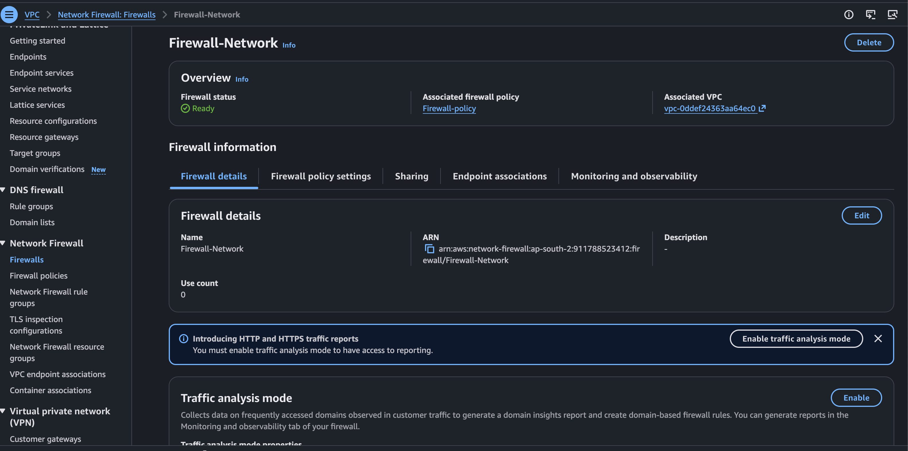
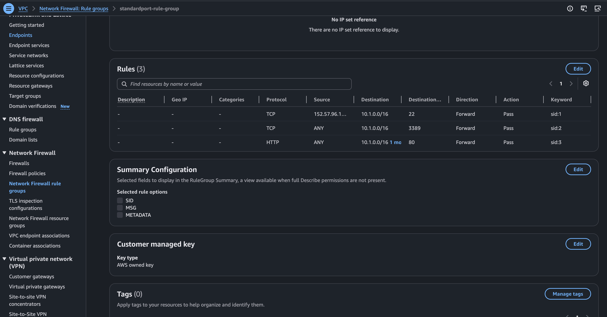
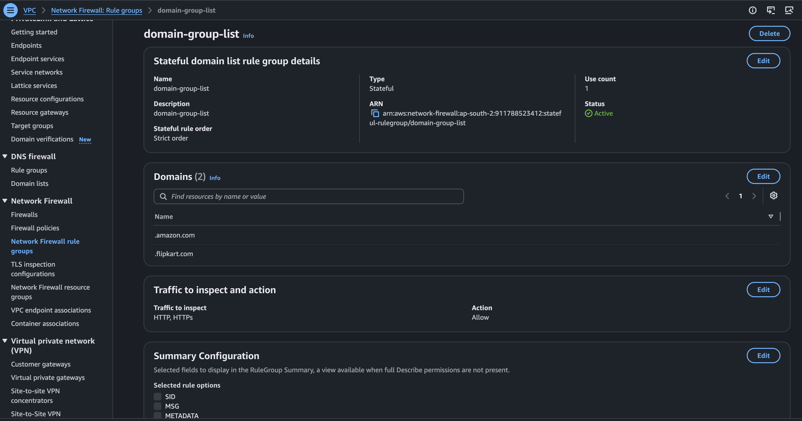
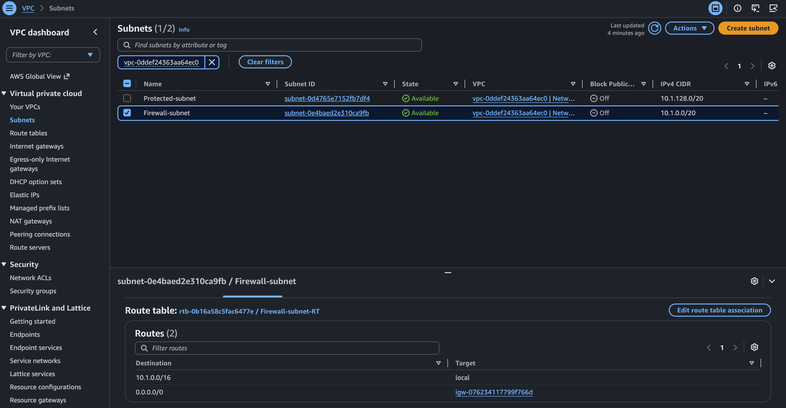
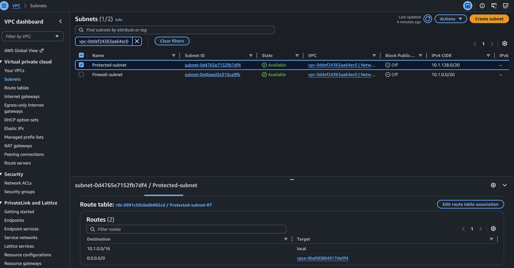
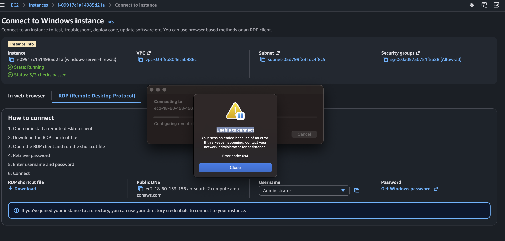
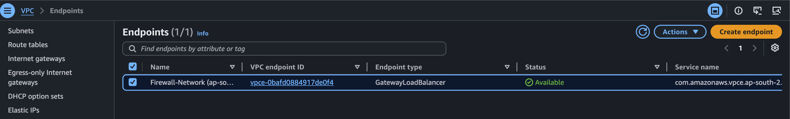
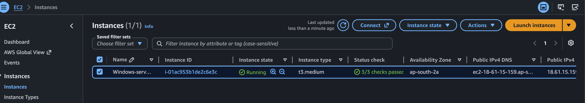
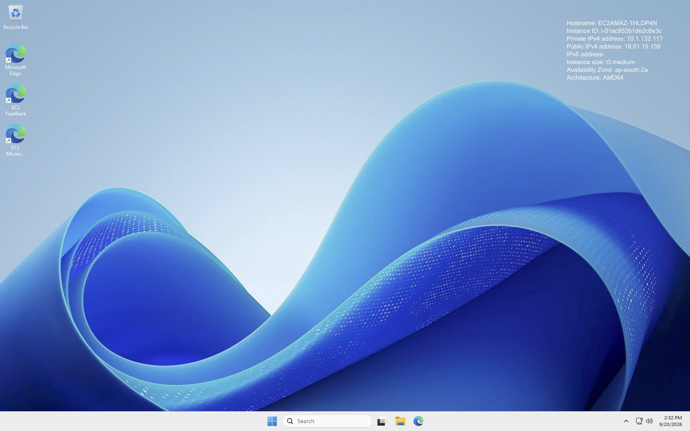

# 🔥 Day 7 – AWS Network Firewall Hands-on Lab

## 📌 Project Overview

In this hands-on AWS project, I implemented **AWS Network Firewall** inside an AWS VPC to inspect and control network traffic.

The lab included:

- AWS VPC
- Firewall subnet
- Protected subnet
- AWS Network Firewall
- Firewall policy
- Stateful Network Firewall rule groups
- Domain-based filtering
- Gateway Load Balancer Endpoint
- Route tables
- Windows Server EC2
- RDP connectivity
- Network troubleshooting
- AWS resource cleanup

The main objective was to understand how network traffic can be routed through **AWS Network Firewall** before reaching a protected workload.

---

# 🏗️ Architecture

## AWS Network Firewall Architecture

```text
                         INTERNET
                            |
                            v
                  +-------------------+
                  | Internet Gateway  |
                  |       IGW         |
                  +---------+---------+
                            |
                            v
        +------------------------------------------+
        |                  AWS VPC                 |
        |              10.1.0.0/16                |
        |                                          |
        |   +-------------------------------+      |
        |   |       Firewall Subnet         |      |
        |   |                               |      |
        |   |    AWS Network Firewall       |      |
        |   |       Firewall-Network        |      |
        |   +---------------+---------------+      |
        |                   |                      |
        |                   v                      |
        |        Firewall Endpoint / GWLBe         |
        |                   |                      |
        |                   v                      |
        |   +-------------------------------+      |
        |   |       Protected Subnet        |      |
        |   |                               |      |
        |   |       Windows Server EC2      |      |
        |   |                               |      |
        |   +-------------------------------+      |
        |                                          |
        +------------------------------------------+
                            |
                            v
                       RDP : 3389
                            |
                            v
                       My Mac / Laptop
```

---

# 🔄 Architecture Flow

The main purpose of this lab was to understand how **AWS Network Firewall is inserted into the VPC traffic path using routing**.

Creating the firewall alone does not automatically cause VPC traffic to pass through it. The relevant route tables must direct traffic through the firewall endpoint.

### Simple Traffic Concept

```text
Traffic
   |
   v
Route Table
   |
   v
Network Firewall Endpoint
   |
   v
AWS Network Firewall
   |
   v
Firewall Policy
   |
   v
Stateful Rule Groups
   |
   v
Allow / Block
```

---

# 1. 🌐 Internet Gateway

The **Internet Gateway (IGW)** provides connectivity between the VPC and the internet.

```text
Internet
   |
   v
Internet Gateway
   |
   v
VPC
```

The Internet Gateway is attached to the VPC.

---

# 2. 🌐 VPC and Subnets

Inside the VPC, separate subnets were created for the firewall and protected workload.

```text
VPC
 |
 +---- Firewall Subnet
 |
 +---- Protected Subnet
```

The **Firewall Subnet** was used for the Network Firewall deployment.

The **Protected Subnet** contained the Windows Server EC2 workload.

AWS Network Firewall creates firewall endpoints in the firewall subnets selected for the firewall.

---

# 3. 🔥 Firewall Subnet

The Network Firewall was deployed in a dedicated firewall subnet.

```text
Firewall Subnet
       |
       v
AWS Network Firewall
       |
       v
Firewall Endpoint
```

The firewall endpoint is the network component used in the routing path for traffic that needs to be inspected.

---

# 4. 🛣️ Route Tables Send Traffic Through the Firewall

This was one of the most important concepts in the lab.

Creating a Network Firewall does **not** automatically place it in the traffic path.

The relevant VPC route tables must be configured so that traffic that should be inspected is directed through the firewall endpoint.

For the protected subnet, the route used in this lab was:

```text
Destination:
0.0.0.0/0

Target:
Gateway Load Balancer Endpoint
```

Conceptually:

```text
Protected Subnet
       |
       v
Route Table
       |
       v
Firewall Endpoint / GWLBe
       |
       v
AWS Network Firewall
```

The exact routing configuration depends on whether inbound traffic, outbound traffic, or both need inspection.

---

# 5. 🛡️ Firewall Policy

The Network Firewall uses a **Firewall Policy** to define how traffic is inspected.

```text
AWS Network Firewall
        |
        v
Firewall Policy
```

The policy created in this lab used two stateful rule groups:

```text
Firewall Policy
       |
       +--------------------------+
       |                          |
       v                          v
Standard Rule Group       Domain Rule Group
standardport-rule-group   domain-group-list
```

---

# 6. 📋 Stateful Rule Groups

Stateful rule groups contain the traffic-matching rules used by the firewall.

## Standard Rule Group

**Name:**

```text
standardport-rule-group
```

Configured TCP ports:

```text
TCP 22
TCP 3389
TCP 80
```

The **TCP 3389** rule was used for Windows RDP connectivity.

## Domain Rule Group

**Name:**

```text
domain-group-list
```

Configured protocols:

```text
HTTP
HTTPS
```

Allowed domains:

```text
.amazon.com
.flipkart.com
```

This rule group was created to practice domain-based traffic filtering.

---

# 7. 🔍 Firewall Inspection

When traffic is routed through the firewall endpoint, AWS Network Firewall evaluates the traffic according to the configured firewall policy and rule groups.

Conceptually:

```text
Traffic
   |
   v
Firewall Endpoint
   |
   v
AWS Network Firewall
   |
   v
Firewall Policy
   |
   v
Stateful Rule Groups
   |
   +---- Allow
   |
   +---- Block
```

AWS Network Firewall uses stateless and stateful inspection according to the configured firewall policy.

---

# 8. 🔐 Protected Subnet

The protected subnet contains the Windows Server EC2 instance.

```text
Protected Subnet
       |
       v
Windows Server EC2
```

The protected subnet route table was configured to send internet-bound traffic toward the Gateway Load Balancer Endpoint.

```text
0.0.0.0/0
     |
     v
Gateway Load Balancer Endpoint
```

---

# 9. 🖥️ Windows Server EC2

A Windows Server EC2 instance was created inside the protected subnet.

The instance was used as the protected test workload.

```text
Protected Subnet
       |
       v
Windows Server EC2
       |
       v
RDP : 3389
```

---

# 10. 💻 RDP Access

I connected to the Windows Server EC2 instance from my Mac using **Remote Desktop Protocol (RDP)**.

```text
My Mac
   |
   | RDP : 3389
   v
Windows Server EC2
```

During the lab, the RDP connection initially failed and required troubleshooting.

After checking the routing and firewall configuration, the RDP connection was successfully established.

---

# 🛠️ What I Practiced

## 1. Created the VPC

Created a dedicated VPC for the Network Firewall lab.

```text
VPC Name: Network-firewall-vpc
CIDR: 10.1.0.0/16
Region: ap-south-2
```

The VPC was used as the main network boundary for the lab.

---

## 2. Created the Firewall Subnet

Created a dedicated subnet for AWS Network Firewall.

```text
Subnet Name: Firewall-subnet
CIDR: 10.1.0.0/20
Availability Zone: ap-south-2a
```

This subnet was used for the Network Firewall deployment.

---

## 3. Created the Protected Subnet

Created a separate protected subnet for the Windows EC2 workload.

The Windows Server EC2 instance was placed inside this protected subnet.

The purpose was to practice routing workload traffic through the Network Firewall endpoint.

---

## 4. Created the Standard Stateful Rule Group

Created:

```text
standardport-rule-group
```

Configuration:

```text
Type: Stateful
Rule Order: Strict
Capacity: 100
```

The rule group contained rules for:

```text
TCP 22
TCP 3389
TCP 80
```

The TCP 3389 rule was used for Windows Remote Desktop traffic.

### Troubleshooting Change

During troubleshooting, the RDP source was temporarily changed to:

```text
ANY
```

This was done to remove the source-IP restriction while testing connectivity.

---

## 5. Created the Domain List Rule Group

Created:

```text
domain-group-list
```

Configuration:

```text
Type: Stateful
Rule Order: Strict
Protocols: HTTP and HTTPS
Action: Allow
```

Allowed domains:

```text
.amazon.com
.flipkart.com
```

This rule group was created to practice domain-based traffic filtering.

---

## 6. Created the Firewall Policy

Created:

```text
Firewall-policy
```

The policy used the two stateful rule groups:

```text
Firewall-policy
       |
       +---- domain-group-list
       |
       +---- standardport-rule-group
```

The policy was then associated with the Network Firewall.

---

## 7. Created AWS Network Firewall

Created:

```text
Firewall-Network
```

Deployed inside:

```text
VPC:
Network-firewall-vpc

Firewall Subnet:
Firewall-subnet
```

The previously created firewall policy was attached to the firewall.

---

## 8. Configured the Gateway Load Balancer Endpoint

A **Gateway Load Balancer Endpoint (GWLBe)** was created for the Network Firewall traffic path.

The endpoint was used as the route target for the protected traffic path.

The endpoint was visible under:

```text
VPC
→ Endpoints
```

and showed the Network Firewall endpoint as a:

```text
Gateway Load Balancer Endpoint
```

---

## 9. Configured the Protected Subnet Route

The protected subnet route table was configured so that internet-bound traffic was sent through the firewall endpoint.

```text
Destination:
0.0.0.0/0

Target:
Gateway Load Balancer Endpoint
```

Traffic concept:

```text
Protected Subnet
       |
       v
GWLBe / Firewall Endpoint
       |
       v
Network Firewall
```

---

## 10. Configured the Firewall Subnet Route

The firewall subnet route table was configured for the required internet path through the Internet Gateway.

The routing configuration allowed the firewall endpoint to participate in the traffic path between the internet gateway and the protected workload.

---

## 11. Created Windows Server EC2

Created a Windows Server EC2 instance inside the protected subnet.

The instance was used as the test workload.

RDP was configured using:

```text
TCP 3389
```

The Windows instance was accessed from my Mac.

---

# 🛠️ Troubleshooting

## Issue 1 – RDP Connection Failed

Initially, RDP was not connecting successfully.

I checked the network connectivity and firewall configuration.

The RDP rule was initially restricted by source IP.

To troubleshoot, I temporarily changed the RDP firewall rule to:

```text
Source:
ANY

Destination:
10.1.0.0/16

Port:
3389

Action:
Pass
```

This helped remove the source-IP restriction while testing the connectivity path.

---

## Issue 2 – Tested TCP 3389 From Mac

I checked the Windows EC2 RDP port from my Mac using:

```bash
nc -vz 40.192.110.252 3389
```

This helped verify TCP connectivity to the Windows RDP service.

---

## Issue 3 – RDP Successfully Connected

After checking the firewall and routing configuration, the Windows EC2 instance successfully became accessible through RDP.

I was able to reach the Windows desktop from my Mac.

This confirmed that the Windows workload could be reached through the configured network path.

---

## Issue 4 – Firewall Could Not Be Deleted

During cleanup, I initially tried to delete:

```text
Firewall-Network
```

AWS returned an error because a related VPC endpoint was still referenced by a route table.

The dependency was the protected subnet route:

```text
0.0.0.0/0
→ Gateway Load Balancer Endpoint
```

### Fix

I went to:

```text
VPC
→ Route Tables
→ Protected-subnet-RT
→ Routes
```

and removed the route pointing to the Gateway Load Balancer Endpoint.

After removing the route, I was able to delete:

```text
Firewall-Network
```

This was an important troubleshooting lesson: **dependent routing and endpoint resources may need to be removed or disconnected before Network Firewall cleanup can be completed.**

---

# 🧹 Cleanup

Because AWS Network Firewall and related networking resources can generate charges, I cleaned up the lab resources after completing the practical.

The cleanup involved removing the resources and dependencies created for the lab.

The general cleanup sequence was:

```text
Windows EC2
      ↓
Network Firewall
      ↓
Firewall Policy
      ↓
Firewall Rule Groups
      ↓
VPC Endpoint
      ↓
Subnets
      ↓
Route Tables
      ↓
Internet Gateway
      ↓
VPC
```

Some resources required dependent routes or resources to be removed first.

---

# 📸 Screenshots

## 01 – Firewall Network Overview

**Firewall Network Overview**

Shows the AWS Network Firewall created for the lab.



---

## 02 – Standard Rule Group

**Standard Rule Group**

Shows the stateful `standardport-rule-group` and its configured network rules.



---

## 03 – Domain Rule Group

**Domain Rule Group**

Shows the `domain-group-list` with the configured domains:

```text
.amazon.com
.flipkart.com
```



---

## 04 – Firewall Subnet Route

**Firewall Subnet Route**

Shows the route configuration associated with the firewall subnet.



---

## 05 – Protected Subnet Route

**Protected Subnet Route**

Shows the protected subnet route sending traffic toward the Gateway Load Balancer Endpoint.



---

## 06 – RDP Error

**RDP Error**

Shows the initial RDP connectivity problem encountered during troubleshooting.



---

## 07 – Firewall Network Endpoint

**Firewall Network Endpoint**

Shows the Gateway Load Balancer Endpoint used in the Network Firewall traffic path.



---

## 08 – Windows Server EC2

**Windows Server EC2**

Shows the Windows Server EC2 instance used as the protected workload.



---

## 09 – Successful RDP Connection

**Successful RDP Connection**

Shows the successful RDP connection to the Windows Server EC2.



---

# 🎯 Final Result

The lab provided hands-on practice with:

- VPC networking
- Firewall and protected subnets
- AWS Network Firewall
- Firewall policies
- Stateful Network Firewall rule groups
- Standard port rules
- Domain-based rule groups
- Gateway Load Balancer Endpoints
- Route tables
- Windows EC2
- RDP connectivity
- Network troubleshooting
- AWS resource cleanup

## Main Traffic Flow

The simplified traffic-flow concept practiced in this lab was:

```text
Internet
   ↓
Internet Gateway
   ↓
VPC Routing
   ↓
Gateway Load Balancer Endpoint
   ↓
AWS Network Firewall
   ↓
Firewall Policy
   ↓
Stateful Rule Groups
   ↓
Protected Subnet
   ↓
Windows Server EC2
   ↓
RDP : 3389
```

The key takeaway from this project was:

> **Route tables determine whether traffic is directed through the Network Firewall endpoint, while the Firewall Policy and Rule Groups determine how the traffic is inspected and handled.**

---

# 🧠 Key Learnings

Through this hands-on lab, I learned how to:

- Create and configure AWS Network Firewall
- Create dedicated firewall and protected subnets
- Create firewall policies
- Configure stateful rule groups
- Configure port-based rules
- Practice domain-based filtering
- Create and use Gateway Load Balancer Endpoints
- Configure route tables for firewall traffic
- Protect a Windows EC2 workload
- Troubleshoot RDP connectivity
- Test TCP connectivity using `nc`
- Identify routing and firewall configuration issues
- Remove dependent routes during cleanup
- Clean up AWS networking resources after the lab

---

# 🧰 Technologies Used

- AWS VPC
- AWS Network Firewall
- Firewall Policy
- Stateful Rule Groups
- Gateway Load Balancer Endpoint
- Route Tables
- Internet Gateway
- Amazon EC2
- Windows Server
- RDP
- TCP/IP Networking
- AWS Console

