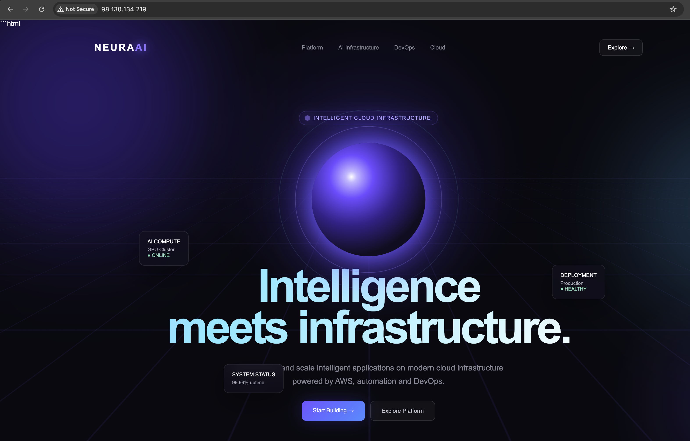
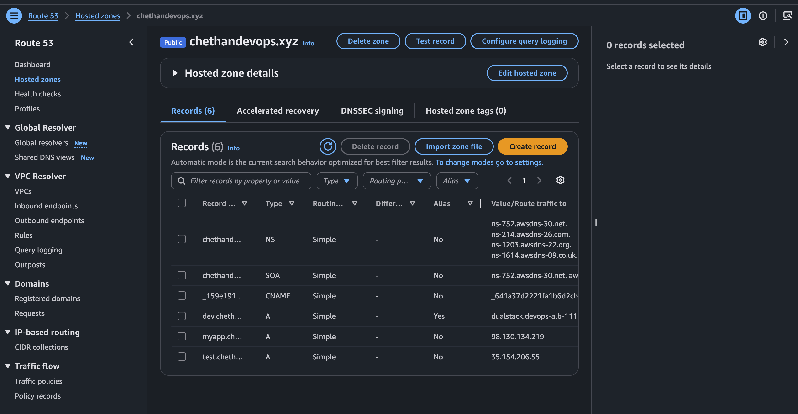
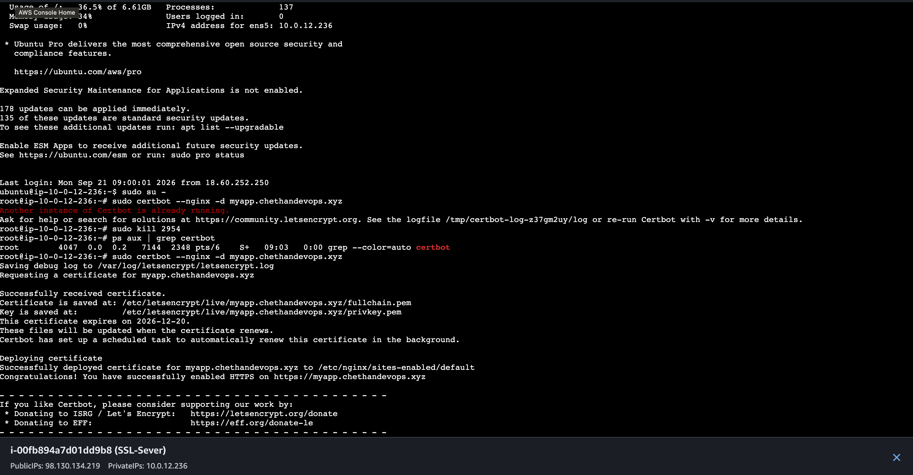
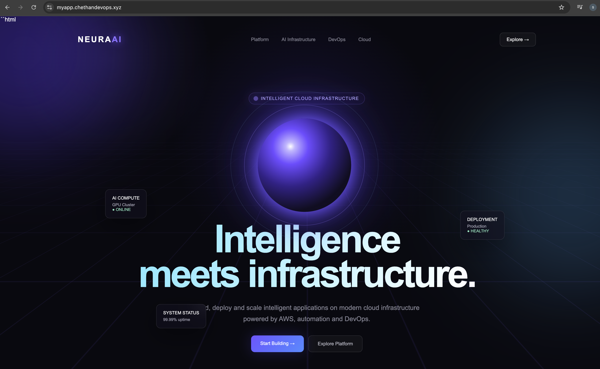
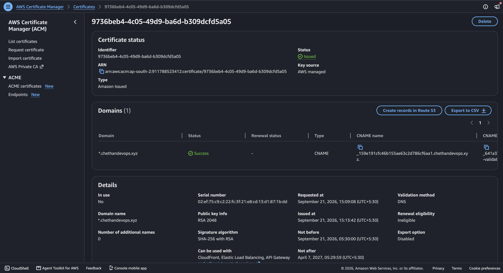
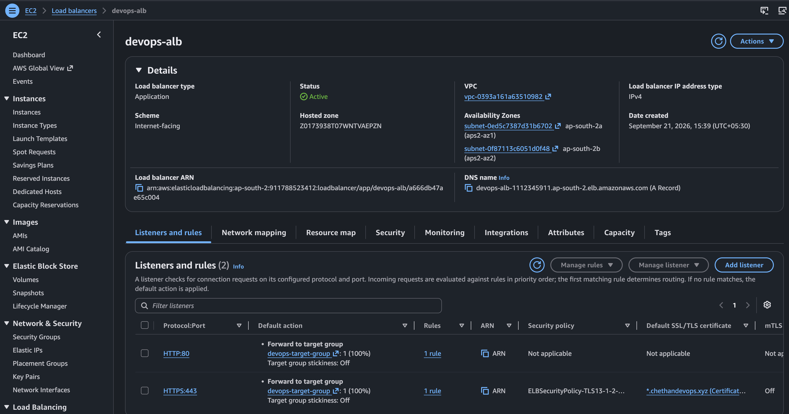
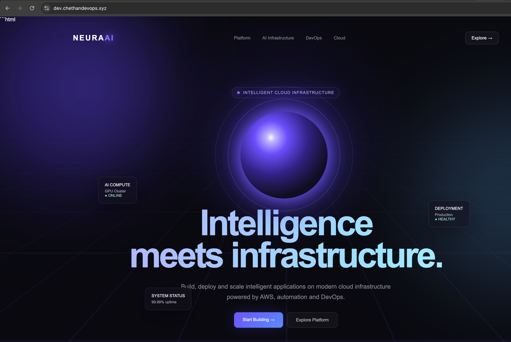

# 🔐 AWS HTTPS Setup with Route 53, Certbot, ACM & Application Load Balancer

## 📌 Project Overview

In this hands-on AWS project, I built and secured a web application running on an Amazon EC2 instance.

I started by launching an EC2 instance, installing Nginx, and hosting a custom animated `index.html` webpage.

I then connected the application to a custom domain using Amazon Route 53 and implemented HTTPS in two different ways:

1. **Certbot + Let's Encrypt** directly on Nginx
2. **AWS Certificate Manager (ACM) + Application Load Balancer (ALB)**

The project also included DNS configuration, SSL/TLS certificate validation, target groups, ALB listeners, and troubleshooting issues encountered during implementation.

---

# 🏗️ Architecture

## Architecture Image


## 🔄 Architecture Flow

```text
User Browser
     |
     | HTTPS :443
     v
dev.chethandevops.xyz
     |
     v
Amazon Route 53
     |
     | Alias Record
     v
Application Load Balancer
devops-alb
     |
     | HTTPS :443
     v
AWS Certificate Manager
*.chethandevops.xyz
     |
     | TLS Termination
     v
Target Group
devops-target-group
     |
     | HTTP :80
     v
EC2 Instance
SSL-Sever
     |
     | Nginx :80
     v
Custom index.html
```

### 🔐 Where HTTPS Is Terminated

In the final architecture, HTTPS is handled at the Application Load Balancer.

```text
Client
  |
  | HTTPS :443
  v
Application Load Balancer
  |
  | ACM Certificate
  v
TLS Termination
  |
  | HTTP :80
  v
EC2
  |
  | Nginx
  v
Website
```

The ACM certificate was **not directly installed on the EC2 Nginx server** in the final `dev` setup.

---

# 🔄 Complete Project Flow

```text
Create EC2
     ↓
Install Nginx
     ↓
Create Custom index.html
     ↓
Test Website
     ↓
Configure Route 53
     ↓
Create myapp Subdomain
     ↓
Test HTTP
     ↓
Install Certbot
     ↓
Let's Encrypt Certificate
     ↓
Configure Nginx HTTPS
     ↓
Test myapp HTTPS
     ↓
Create dev Subdomain
     ↓
Test dev HTTP
     ↓
Request ACM Wildcard Certificate
     ↓
Route 53 DNS Validation
     ↓
ACM Certificate Issued
     ↓
Create Application Load Balancer
     ↓
Create Target Group
     ↓
Register EC2
     ↓
Create HTTPS :443 Listener
     ↓
Attach ACM Certificate
     ↓
Change Route 53 dev Record
to ALB Alias
     ↓
Test dev HTTPS
     ↓
🔒 Secure Website
```

---

# 🛠️ AWS Services Used

- Amazon EC2
- Nginx
- Amazon Route 53
- AWS Certificate Manager (ACM)
- Application Load Balancer (ALB)
- Target Groups
- Security Groups
- Let's Encrypt
- Certbot

---

# 🚀 Step-by-Step Implementation

## 1. Created EC2 Instance

I created an EC2 instance in AWS.

The instance was used as the web server for the application.

The EC2 instance was running inside my AWS VPC and had a private IP address.

---

## 2. Installed Nginx

After connecting to the EC2 instance, I installed Nginx.

I verified that Nginx was running successfully.

Nginx was configured to serve the website on:

```text
HTTP :80
```

---

## 3. Created a Custom Website

I replaced the default Nginx webpage with my own custom `index.html`.

The page was an animated, futuristic AI/SaaS-style landing page.

The website was stored under:

```text
/var/www/html/
```

I then tested the website using the EC2 public IP.

### 📸 Screenshot



---

# 🌐 4. Configured Route 53

I used the existing Route 53 hosted zone:

```text
chethandevops.xyz
```

I created the subdomain:

```text
myapp.chethandevops.xyz
```

The DNS record initially pointed to the EC2 public IPv4 address.

The DNS flow was:

```text
myapp.chethandevops.xyz
          ↓
      Route 53
          ↓
    EC2 Public IP
          ↓
        Nginx
          ↓
    Custom Website
```

### 📸 Screenshot



---

# 🔎 5. DNS Troubleshooting

During the initial setup, I tested DNS resolution using `nslookup`.

The DNS lookup did not work as expected during the initial stage.

I checked the Route 53 configuration and DNS records and continued with the domain configuration until DNS resolution worked correctly.

This helped me understand that:

```text
DNS Resolution
```

and

```text
Website Availability
```

are separate parts of the application flow.

---

# 🔒 6. Installed Certbot

To configure HTTPS directly on Nginx, I installed Certbot on the EC2 instance.

Certbot was used with Nginx to obtain a Let's Encrypt SSL/TLS certificate.

The certificate was successfully generated and deployed to Nginx.

### 📸 Screenshot



---

# 🔐 7. Configured HTTPS with Certbot

I used Certbot to configure HTTPS for:

```text
myapp.chethandevops.xyz
```

After successful certificate deployment, I tested the website using HTTPS:

```text
https://myapp.chethandevops.xyz
```

The browser displayed the secure lock icon.

The flow became:

```text
Browser
   |
HTTPS :443
   |
Nginx
   |
Let's Encrypt Certificate
   |
Website
```

### 📸 Screenshot



I also learned that certificate configuration contains important files such as:

```text
fullchain.pem
privkey.pem
```

The private key must always be kept secure and should never be uploaded to GitHub.

---

# 🌍 8. Created Another Subdomain

I then created another Route 53 record:

```text
dev.chethandevops.xyz
```

Initially, the record pointed directly to the EC2 public IP.

The website opened successfully, but the browser showed:

```text
Not Secure
```

This became the main problem to troubleshoot.

---

# 🧩 9. Requested ACM Wildcard Certificate

I requested a wildcard ACM certificate for:

```text
*.chethandevops.xyz
```

I selected:

- Public certificate
- DNS validation
- RSA 2048
- Export disabled

AWS Certificate Manager generated a DNS validation CNAME record.

I added the CNAME record to the Route 53 hosted zone.

After DNS validation completed, the ACM certificate status changed to:

```text
Issued
```

### 📸 Screenshot



---

# ⚠️ 10. Why HTTPS Was Still Not Working

Even after the ACM certificate showed:

```text
Issued
```

the `dev` website was still not secure.

The reason was that the ACM certificate had been issued successfully, but it was **not yet attached to the service handling HTTPS traffic**.

At that time the flow was:

```text
dev.chethandevops.xyz
        ↓
Route 53
        ↓
EC2 Public IP
        ↓
Nginx
```

The EC2/Nginx server was not using the ACM certificate.

This helped me understand the difference between:

```text
Certificate Issued
```

and

```text
Certificate Actually Attached to an AWS Service
```

---

# ⚖️ 11. Created Application Load Balancer

To use the ACM certificate with AWS infrastructure, I created an Internet-facing Application Load Balancer.

Name:

```text
devops-alb
```

The ALB was configured across two Availability Zones:

```text
ap-south-2a
ap-south-2b
```

I also created a security group:

```text
devops-alb-sg
```

The ALB allowed:

```text
HTTP  :80
HTTPS :443
```

---

# 🎯 12. Created Target Group

I created a target group:

```text
devops-target-group
```

Configuration:

```text
Target type: Instance
Protocol: HTTP
Port: 80
Health check: HTTP
Health check path: /
```

I registered the EC2 instance:

```text
SSL-Sever
Port: 80
```

The target group was responsible for forwarding traffic from the ALB to the EC2 instance.

---

# 🔐 13. Added HTTPS Listener

I added an HTTPS listener to the ALB:

```text
HTTPS :443
```

The listener used the ACM wildcard certificate:

```text
*.chethandevops.xyz
```

The listener forwarded traffic to:

```text
devops-target-group
```

The flow became:

```text
Client
  |
  | HTTPS :443
  v
ALB
  |
  | ACM Certificate
  v
Target Group
  |
  | HTTP :80
  v
EC2
  |
Nginx
```

### 📸 Screenshot



---

# 🌐 14. Changed Route 53 to ALB Alias

The `dev` DNS record originally pointed directly to the EC2 public IP.

I changed the record to an **A record with Alias enabled** and selected the Application Load Balancer.

The final DNS flow became:

```text
dev.chethandevops.xyz
        ↓
Route 53
        ↓
Alias Record
        ↓
Application Load Balancer
        ↓
devops-alb
```

This allowed the domain to reach the ALB instead of connecting directly to EC2.

---

# ✅ 15. Final HTTPS Test

I tested:

```text
https://dev.chethandevops.xyz
```

The website loaded successfully with the secure lock icon.

The final end-to-end flow was:

```text
Internet
   ↓
dev.chethandevops.xyz
   ↓
Route 53
   ↓
ALB
   ↓
HTTPS :443
   ↓
ACM Wildcard Certificate
   ↓
Target Group
   ↓
HTTP :80
   ↓
EC2
   ↓
Nginx
   ↓
index.html
```

### 📸 Screenshot



---

# 🐛 Troubleshooting Performed

## Issue 1 — DNS Lookup Problem

### Problem

`nslookup` did not work correctly during the initial DNS setup.

### Investigation

I checked the Route 53 configuration and DNS records.

### Resolution

After configuring the domain/subdomain correctly through Route 53, DNS resolution worked.

---

## Issue 2 — Certbot Process Interruption

### Problem

The EC2 connection was interrupted while Certbot was running.

### Investigation

After reconnecting to the EC2 instance, I checked whether the Certbot process was still running.

### Resolution

I stopped the remaining Certbot process and ran the Certbot command again.

The certificate was then successfully generated and deployed.

---

## Issue 3 — `myapp` HTTPS Initially Not Secure

### Problem

The domain worked over HTTP, but HTTPS was not secure.

### Resolution

I installed Certbot and configured the Let's Encrypt certificate with Nginx.

After successful deployment, the browser showed the secure lock.

---

## Issue 4 — ACM Certificate Was Issued but `dev` Was Still Not Secure

### Problem

ACM showed:

```text
Issued
```

but:

```text
dev.chethandevops.xyz
```

was still not secure.

### Root Cause

The ACM certificate was not attached to the service receiving HTTPS traffic.

The domain was still pointing directly to EC2.

### Resolution

I created and configured:

```text
Application Load Balancer
        ↓
Target Group
        ↓
HTTPS :443 Listener
        ↓
ACM Certificate
        ↓
Route 53 Alias
```

After changing the DNS record to the ALB Alias, HTTPS worked successfully.

---

# 🔑 Key Configuration

### Domain

```text
chethandevops.xyz
```

### Subdomains

```text
myapp.chethandevops.xyz
dev.chethandevops.xyz
```

### ACM Certificate

```text
*.chethandevops.xyz
```

### Load Balancer

```text
devops-alb
```

### Target Group

```text
devops-target-group
```

### Backend

```text
EC2
 ↓
Nginx
 ↓
HTTP :80
```

### HTTPS

```text
Client
 ↓
ALB HTTPS :443
 ↓
ACM Certificate
 ↓
Target Group
 ↓
EC2 HTTP :80
```

---

# 📸 Project Screenshots

## 01 — EC2 Nginx Custom Website


---

## 02 — Route 53 DNS Records


---

## 03 — Certbot Certificate Success


---

## 04 — MyApp HTTPS Secure


---

## 05 — ACM Wildcard Certificate Issued


---

## 06 — ALB HTTPS Listener with ACM


---

## 07 — Dev HTTPS Secure Final


---

# 📋 Screenshot Summary

| # | Screenshot | What it proves |
|---|---|---|
| 01 | EC2 Nginx Custom Website | EC2 + Nginx + custom website |
| 02 | Route 53 DNS Records | Domain/DNS configuration |
| 03 | Certbot Certificate Success | Let's Encrypt certificate creation |
| 04 | MyApp HTTPS Secure | HTTPS working directly through Nginx |
| 05 | ACM Wildcard Certificate Issued | ACM certificate + DNS validation |
| 06 | ALB HTTPS Listener ACM | ALB + HTTPS 443 + ACM certificate |
| 07 | Dev HTTPS Secure Final | Final end-to-end HTTPS setup |

---

# 🧹 Lab Cleanup

After completing the screenshots and testing, I cleaned up the AWS resources created specifically for the lab to avoid unnecessary AWS charges.

The project documentation represents the configuration and successful test performed during the hands-on lab.

---

# 🎯 Project Outcome

Successfully implemented and tested:

- EC2 web hosting
- Nginx web server
- Custom HTML website
- Route 53 DNS
- Let's Encrypt + Certbot
- HTTPS directly on Nginx
- AWS Certificate Manager
- DNS certificate validation
- Wildcard SSL/TLS certificate
- Application Load Balancer
- ALB HTTPS listener
- Target Group
- Route 53 Alias to ALB
- End-to-end HTTPS traffic flow
- DNS and certificate troubleshooting

The final lab test successfully accessed:

```text
dev.chethandevops.xyz
```

over HTTPS with a valid certificate and secure browser connection.

**Note:** AWS resources were cleaned up after testing, so the project should be considered a completed hands-on lab rather than a currently running production application.
