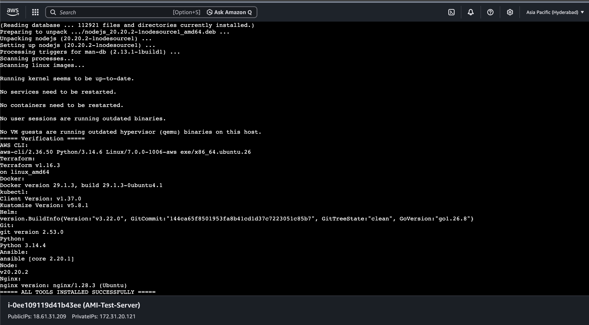
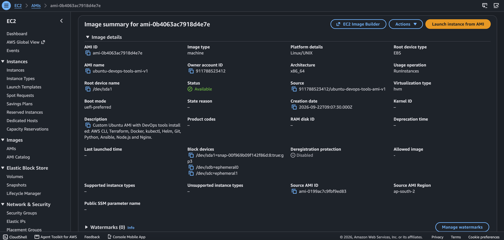
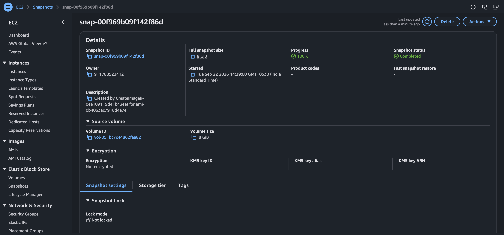
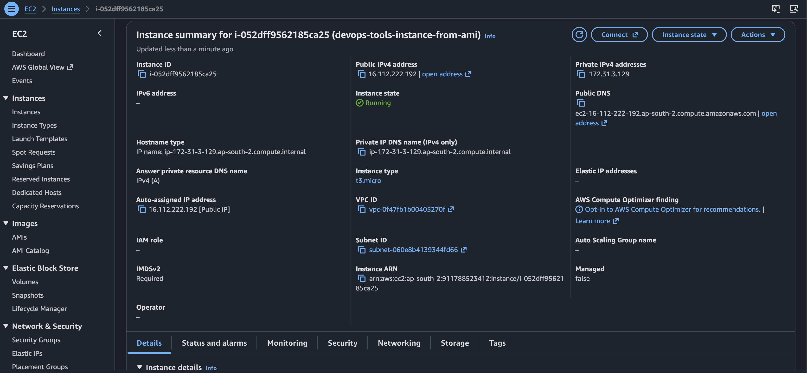
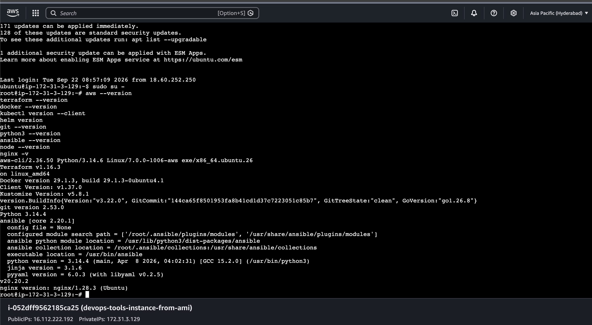

# Day 09 – AWS Custom AMI with Preinstalled DevOps Tools

## 📌 Project Overview

In this hands-on project, I created a **custom Ubuntu AMI** with commonly used Cloud and DevOps tools preinstalled.

The purpose of this project was to create a reusable EC2 image so that a new EC2 instance could be launched with the required DevOps tools already available, without installing them again manually.

### DevOps Tools Installed

- AWS CLI
- Terraform
- Docker
- kubectl
- Helm
- Git
- Python
- Ansible
- Node.js
- Nginx

---

# 🏗️ Architecture

```text
                    AWS Region
                  ap-south-2
                       │
                       ▼
              ┌──────────────────┐
              │   Ubuntu EC2     │
              │   Base Instance  │
              └────────┬─────────┘
                       │
                       │ Install DevOps Tools
                       ▼
        ┌──────────────────────────────┐
        │      DevOps Tools            │
        │                              │
        │  AWS CLI                     │
        │  Terraform                   │
        │  Docker                      │
        │  kubectl                     │
        │  Helm                        │
        │  Git                         │
        │  Python                      │
        │  Ansible                     │
        │  Node.js                     │
        │  Nginx                       │
        └──────────────┬───────────────┘
                       │
                       │ Create Image
                       ▼
              ┌──────────────────┐
              │   Custom AMI     │
              │ ubuntu-devops-   │
              │ tools-ami-v1     │
              └────────┬─────────┘
                       │
                       │ AMI creation
                       ▼
              ┌──────────────────┐
              │   EBS Snapshot   │
              └──────────────────┘
                       │
                       │ Launch Instance
                       ▼
              ┌──────────────────┐
              │    New EC2       │
              │ From Custom AMI  │
              └────────┬─────────┘
                       │
                       │ Verify
                       ▼
              ┌──────────────────┐
              │ DevOps Tools     │
              │ Already Available│
              └──────────────────┘
```

---

# 🔄 Architecture Flow

```text
Ubuntu EC2
    │
    ▼
Install DevOps Tools
    │
    ▼
Verify Installed Tools
    │
    ▼
Create Custom AMI
    │
    ▼
AMI Creates EBS Snapshot
    │
    ▼
Launch New EC2 from Custom AMI
    │
    ▼
Connect to New EC2
    │
    ▼
Verify DevOps Tools
    │
    ▼
Tools Available Without Reinstallation
```

---

# 🛠️ What I Did – Step by Step

## Step 1 – Launched Ubuntu EC2 Instance

I launched an Ubuntu EC2 instance in AWS.

The instance was used as the base server for installing the required Cloud and DevOps tools.

Configuration used:

- Operating System: Ubuntu
- Instance Type: `t3.micro`
- AWS Region: `ap-south-2`

---

## Step 2 – Connected to the Ubuntu EC2 Instance

I connected to the Ubuntu EC2 instance using SSH.

After connecting, I verified that the server was working correctly before installing the required tools.

---

## Step 3 – Installed DevOps Tools

I created and executed a shell script to install the required DevOps tools.

The following tools were installed:

| Tool | Version Verified |
|---|---|
| AWS CLI | 2.36.50 |
| Terraform | 1.16.3 |
| Docker | 29.1.3 |
| kubectl | 1.37.0 |
| Helm | 3.22.0 |
| Git | 2.53.0 |
| Python | 3.14.4 |
| Ansible | 2.20.1 |
| Node.js | v20.20.2 |
| Nginx | 1.28.3 |

---

## Step 4 – Verified the Installed Tools

After installation, I verified the versions of all the installed tools.

This confirmed that the required DevOps tools were available and working correctly on the base Ubuntu EC2 instance.

### Screenshot



---

# 🖼️ Custom AMI Creation

## Step 5 – Created a Custom AMI

After installing and verifying all the tools, I created a custom AMI from the Ubuntu EC2 instance.

### Custom AMI Details

**AMI Name:**

```text
ubuntu-devops-tools-ami-v1
```

**AMI Description:**

```text
Custom Ubuntu AMI with DevOps tools installed:
AWS CLI, Terraform, Docker, kubectl, Helm, Git,
Python, Ansible, Node.js and Nginx.
```

The AMI was created successfully and reached the `Available` state.

### Screenshot



---

# 💾 EBS Snapshot

## Step 6 – EBS Snapshot Created During AMI Creation

When the custom AMI was created, AWS created an associated EBS snapshot for the root volume.

The snapshot contains the disk data required for creating EC2 instances from the AMI.

### Screenshot



---

# 🚀 Launching EC2 from Custom AMI

## Step 7 – Launched a New EC2 Instance

After the custom AMI became available, I used the AMI to launch a new EC2 instance.

The new instance was created from the custom AMI instead of using the original Ubuntu AMI.

### New EC2 Name

```text
devops-tools-instance-from-ami
```

### Instance Type

```text
t3.micro
```

### Screenshot



---

# 🔍 Verification on New EC2

## Step 8 – Connected to the New EC2 Instance

I connected to the newly launched EC2 instance.

The purpose was to verify whether the DevOps tools from the original EC2 instance were already available.

---

## Step 9 – Verified DevOps Tools Without Reinstalling

I checked the installed tools on the new EC2 instance.

The same tools were available:

- AWS CLI
- Terraform
- Docker
- kubectl
- Helm
- Git
- Python
- Ansible
- Node.js
- Nginx

No separate installation was required on the new EC2 instance.

### Screenshot



---

# 📸 Screenshots

## 1. DevOps Tools Installed on Ubuntu EC2


---

## 2. Custom AMI Created and Available


---

## 3. New EC2 Launched from Custom AMI


---

## 4. DevOps Tools Verified on New EC2


---

## 5. EBS Snapshot Created for Custom AMI


---

# 🧹 Cleanup

After completing the hands-on practice and taking the required screenshots, I cleaned up the AWS resources to avoid unnecessary charges.

The following resources were removed:

- Terminated the new EC2 instance
- Terminated the original EC2 instance
- Deregistered the custom AMI
- Deleted the associated EBS snapshot

---

# 📚 Key Learnings

Through this hands-on project, I practiced:

- Launching Ubuntu EC2
- Installing multiple DevOps tools
- Creating a custom AMI
- Understanding AMI and EBS snapshot relationship
- Launching EC2 from a custom AMI
- Verifying preinstalled tools on a new EC2 instance
- Reusing a configured server environment
- Cleaning up AWS resources after the lab

---

# 🎯 Project Outcome

Successfully created a reusable **custom Ubuntu AMI containing 10 commonly used Cloud and DevOps tools**.

A new EC2 instance was launched from the custom AMI, and all the required tools were available immediately without performing the installation process again.

This demonstrated how custom AMIs can be used to create standardized and reusable EC2 environments.

---

# 🏷️ Project Information

**Project:** AWS Custom AMI with Preinstalled DevOps Tools

**Type:** Personal Hands-on Project

**Cloud Provider:** AWS

**Region:** `ap-south-2`

**Operating System:** Ubuntu

**Instance Type:** `t3.micro`

**AMI:** Custom Ubuntu AMI

**Tools Installed:** 10 DevOps Tools
