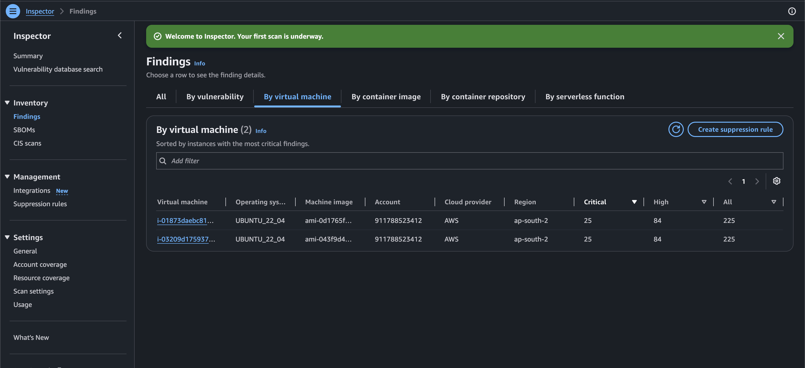
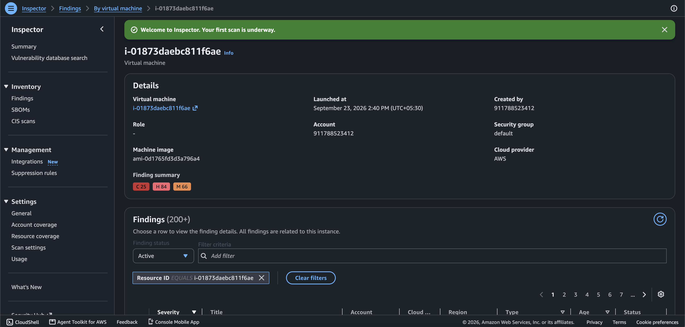
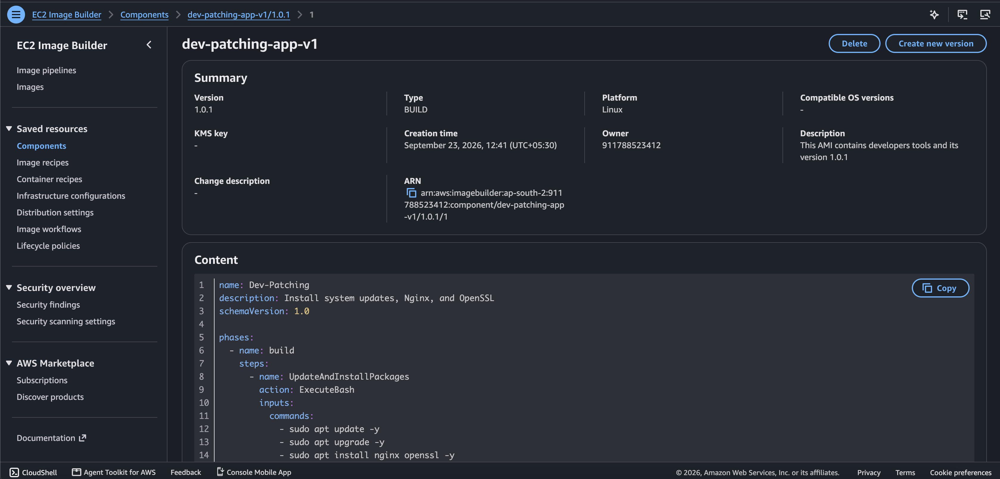
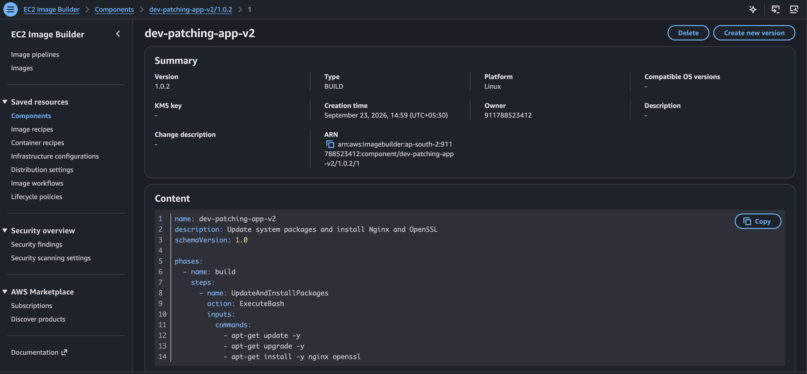
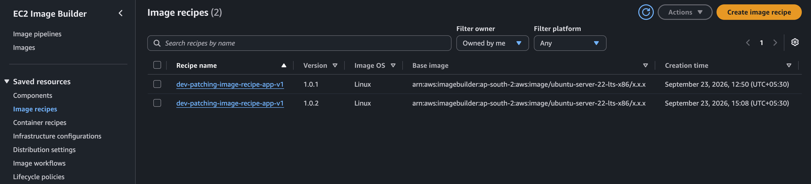
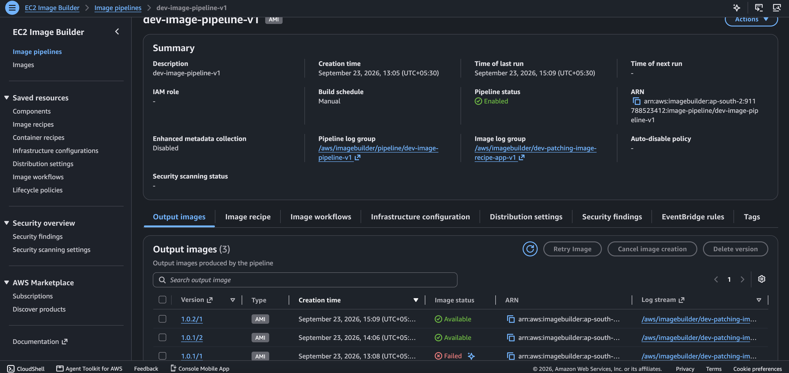
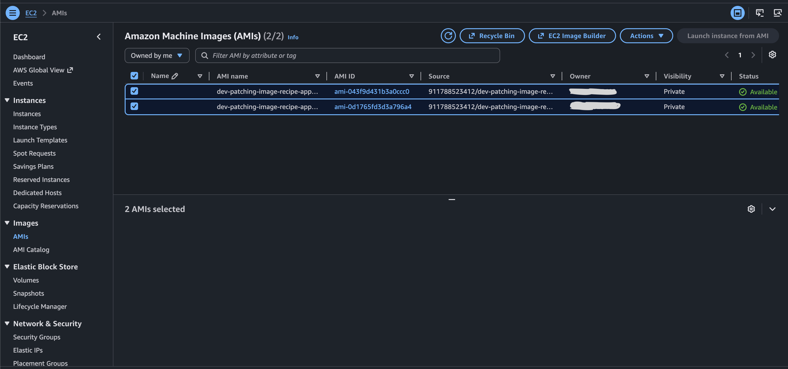
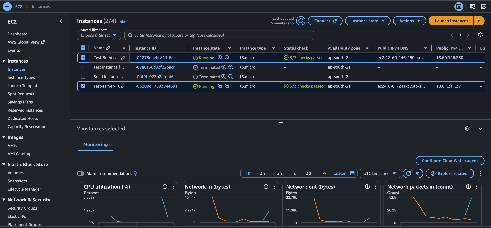
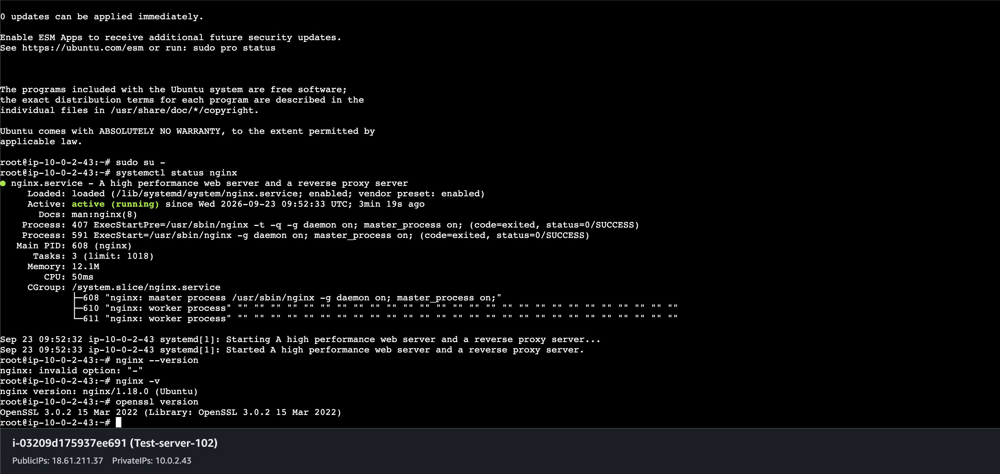

# Day 10 - Amazon Inspector + EC2 Image Builder Patching

## Project Overview

This hands-on project demonstrates how **Amazon Inspector** can identify vulnerabilities on EC2 instances and how **EC2 Image Builder** can be used to create updated and standardized AMIs.

In this project, I:

- Enabled Amazon Inspector for EC2 resources.
- Scanned EC2 instances for vulnerabilities.
- Reviewed Inspector findings.
- Created an EC2 Image Builder component for system updates and package installation.
- Created different component versions.
- Created Image Builder recipe versions.
- Created and executed an Image Builder pipeline.
- Troubleshot an Image Builder build failure related to SSM communication.
- Created a new AMI.
- Launched EC2 instances from the generated AMIs.
- Verified NGINX and OpenSSL versions on the new EC2 instance.

---

# Architecture

## Architecture Diagram


> Add the architecture image to the Day 10 project folder and name it `architecture.png`.

## Architecture Flow

```text
                 AWS Environment
                       |
                       v
              Amazon Inspector
                       |
                       | Vulnerability Scan
                       v
                EC2 Instance
                       |
                       | Findings
                       v
             Vulnerability Review
                       |
                       v
              DevOps Remediation
                       |
                       v
              EC2 Image Builder
                       |
              +--------+--------+
              |                 |
              v                 v
        Image Recipe     Infrastructure Config
              |                 |
              +--------+--------+
                       |
                       v
                Image Pipeline
                       |
                       v
              Temporary Build EC2
                       |
                       v
             Run Image Components
                       |
                       | apt update
                       | apt upgrade
                       | install packages
                       v
                  Validation
                       |
                       v
                  New AMI
                       |
                       v
             Launch New EC2
                       |
                       v
              Verify Versions
                       |
                       v
              Inspector Rescan
```

---

# Services Used

- Amazon Inspector
- Amazon EC2
- EC2 Image Builder
- Amazon VPC
- IAM
- AWS Systems Manager (SSM)
- Amazon CloudWatch Logs
- Ubuntu Linux
- NGINX
- OpenSSL

---

# Step-by-Step Implementation

## Step 1 - Enable Amazon Inspector

I opened **Amazon Inspector** and activated scanning for the account.

Inspector resource coverage included:

- Amazon EC2
- Amazon ECR
- AWS Lambda

For this project, the main focus was **EC2 vulnerability scanning**.

### Screenshot



---

# Step 2 - Review EC2 Vulnerability Findings

After the EC2 instance was scanned by Inspector, I reviewed the vulnerability findings.

Inspector identified multiple security findings with different severity levels such as:

- Critical
- High
- Medium

I opened the EC2 finding details to understand the vulnerabilities reported for the instance.

### Screenshot



---

# Step 3 - Create Image Builder Component Version 1.0.1

I created an EC2 Image Builder component to automate system updates and package installation.

The component performs:

```bash
apt-get update -y
apt-get upgrade -y
apt-get install -y nginx openssl
```

The purpose of the component was to automate the update and installation process during AMI creation.

### Component

```text
Name: dev-patching-app-v1
Version: 1.0.1
Platform: Linux
```

### Screenshot



---

# Step 4 - Create New Component Version 1.0.2

To update the patching configuration, I created a new version of the Image Builder component.

```text
Component Version: 1.0.2
```

The updated component continued to perform system package updates and install NGINX and OpenSSL.

Component versions allow Image Builder configurations to be updated without modifying the previous version.

### Screenshot



---

# Step 5 - Create Image Recipe Versions

I created Image Builder recipe versions and attached the required component version.

The recipe defines:

```text
Base AMI
   +
Image Builder Components
   =
Image Recipe
```

The recipe was then used by the Image Builder pipeline to create the final AMI.

### Screenshot



---

# Step 6 - Configure Image Builder Pipeline

I created an Image Builder pipeline using the image recipe and infrastructure configuration.

The infrastructure configuration defined where the temporary build instance would run.

The configuration included:

- VPC
- Public subnet
- Security group
- IAM instance profile
- EC2 instance type

The pipeline was configured for manual execution.

### Pipeline

```text
dev-image-pipeline-v1
```

### Screenshot



---

# Step 7 - Image Builder Launches Temporary Build EC2

When the pipeline runs, EC2 Image Builder launches a temporary EC2 instance.

The temporary instance is used to:

1. Start from the base AMI.
2. Connect through Systems Manager.
3. Run the configured Image Builder components.
4. Apply package updates.
5. Install required packages.
6. Validate the build.
7. Create the final AMI.
8. Terminate the temporary build instance.

The overall process is automated by Image Builder.

---

# Step 8 - Troubleshooting Image Builder Build Failure

During the first Image Builder pipeline execution, the build failed while communicating with the temporary EC2 instance through Systems Manager.

The workflow showed that the build instance launched successfully, but the SSM command could not communicate with the instance.

The important error was:

```text
InvalidInstanceId
```

### What I checked

I checked:

- Image Builder IAM role
- IAM instance profile
- VPC
- Subnet
- Route table
- Security group
- Outbound connectivity
- SSM communication
- Public IPv4 configuration

The temporary EC2 instance was launching successfully, but the SSM communication required for the Image Builder build was not working as expected.

### Fix

I enabled **Auto-assign Public IPv4 address** for the subnet used by the Image Builder infrastructure configuration.

After enabling public IPv4 addressing, I ran the Image Builder pipeline again.

The subsequent pipeline execution completed successfully.

> This was the main troubleshooting issue I faced during the Image Builder build.

---

# Step 9 - Image Builder Pipeline Completed Successfully

After fixing the networking configuration, I ran the pipeline again.

The successful workflow completed the major steps:

```text
Launch Build Instance
        ↓
Apply Build Components
        ↓
Run Sanitize Script
        ↓
Create Output AMI
        ↓
Terminate Build Instance
```

Some workflow steps were skipped because they were not applicable to the Linux build configuration.

---

# Step 10 - New AMI Created

After the successful Image Builder pipeline execution, a new AMI was created.

The generated AMI became available and could be used to launch new EC2 instances.

### Screenshot



---

# Step 11 - Launch EC2 Instances From Generated AMIs

I launched EC2 instances using the AMIs generated by Image Builder.

This allowed me to verify that the AMI contained the required configuration and software.

### Screenshot



---

# Step 12 - Verify NGINX and OpenSSL

After launching the EC2 instance from the generated AMI, I connected to the instance and verified the installed software.

### Check NGINX

```bash
systemctl status nginx
```

```bash
nginx -v
```

### Check OpenSSL

```bash
openssl version
```

The verification confirmed that NGINX was installed and running on the new EC2 instance.

The package update process also demonstrated that software packages can change when newer versions are available through the configured Ubuntu repositories.

### Screenshot



---

# Complete Project Flow

```text
Amazon Inspector
       |
       v
Find Vulnerabilities
       |
       v
Review Findings
       |
       v
Identify Required Remediation
       |
       v
Create / Update Image Builder Component
       |
       v
Create New Component Version
       |
       v
Create New Image Recipe Version
       |
       v
Run Image Builder Pipeline
       |
       v
Temporary Build EC2
       |
       v
Apply Updates and Install Packages
       |
       v
Create New AMI
       |
       v
Launch EC2 From New AMI
       |
       v
Verify NGINX / OpenSSL
       |
       v
Inspector Rescan
```

---

# Troubleshooting Summary

## Issue 1 - Image Builder SSM Communication Failure

### Problem

The Image Builder temporary EC2 instance launched successfully, but the pipeline failed when attempting to communicate with the instance through Systems Manager.

Error observed:

```text
InvalidInstanceId
```

### Investigation

I checked:

- IAM role
- IAM instance profile
- VPC
- Subnet
- Route table
- Security group
- Network connectivity
- Public IPv4 configuration

### Fix

I enabled **Auto-assign Public IPv4 address** for the subnet used by the Image Builder infrastructure configuration.

After that, I executed the pipeline again and the build completed successfully.

---

# Important Versioning

This project uses multiple types of versions.

```text
Component
   1.0.1
   ↓
   1.0.2

Recipe
   Version 1
   ↓
   Version 2

Pipeline
   ↓
Build
   ↓
New AMI
   ↓
New EC2
```

The Image Builder component version such as `1.0.2` is the **component configuration version**.

It should not be confused with the actual software version of NGINX or OpenSSL.

---

# Key Learning From This Project

- Amazon Inspector identifies security vulnerabilities and produces findings.
- Inspector findings need to be reviewed and remediated.
- EC2 Image Builder automates the creation of standardized AMIs.
- Image Builder components contain the commands that run during the image build.
- Image recipes combine a base AMI with components.
- Infrastructure configuration controls where the temporary build instance runs.
- Image Builder pipelines automate the complete AMI creation process.
- Component and recipe versioning allows controlled changes to image builds.
- A new AMI can be created after updating the Image Builder configuration.
- New EC2 instances can then be launched from the updated AMI.
- Software versions should be verified after launching the new instance.
- Inspector findings should be rescanned after remediation; not every finding is necessarily resolved by a single package update.

---

# Screenshots

## 01 - Inspector EC2 Vulnerability Scan


## 02 - Inspector 1.0.1 EC2 Finding Details


## 03 - Image Builder Component v1.0.1


## 04 - Image Builder Component v1.0.2


## 05 - Image Builder Recipe Versions 1.0.1 and 1.0.2


## 06 - Image Builder Pipeline Version History


## 07 - Image Builder AMI Available


## 08 - EC2 Instances Launched From AMIs


## 10 - 1.0.2 EC2 Version Verification


---

# Project Outcome

Successfully demonstrated an end-to-end workflow for:

```text
Vulnerability Detection
        ↓
Finding Review
        ↓
Patch / Update Configuration
        ↓
Image Builder Component Version
        ↓
Image Recipe Version
        ↓
Image Builder Pipeline
        ↓
New AMI
        ↓
New EC2
        ↓
Software Verification
```

This project provided hands-on experience with **Amazon Inspector, EC2 Image Builder, AMI creation, IAM, Systems Manager, EC2, VPC networking, package updates, troubleshooting, and versioned image management**.
