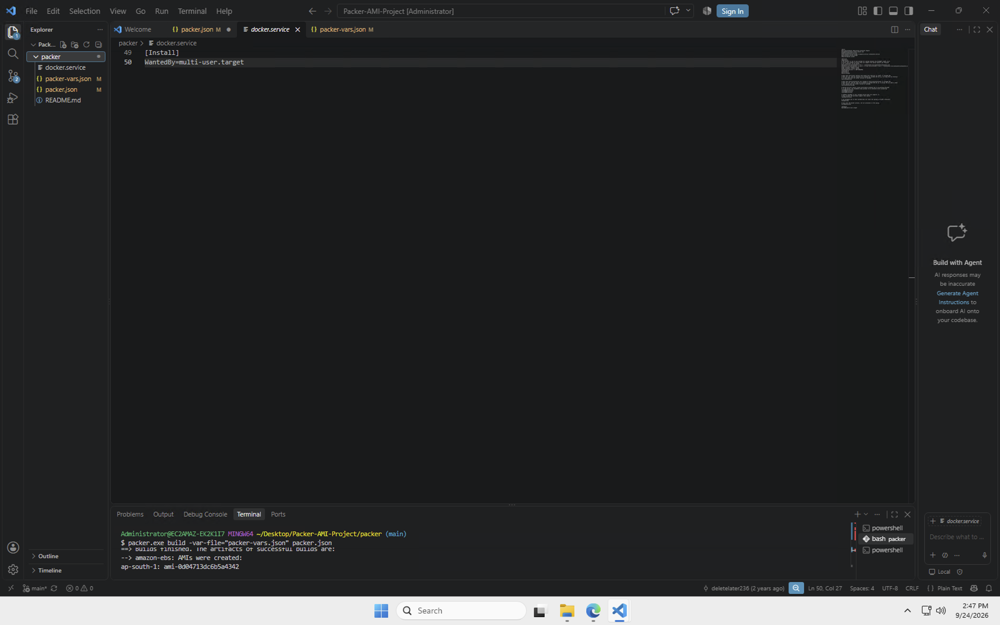
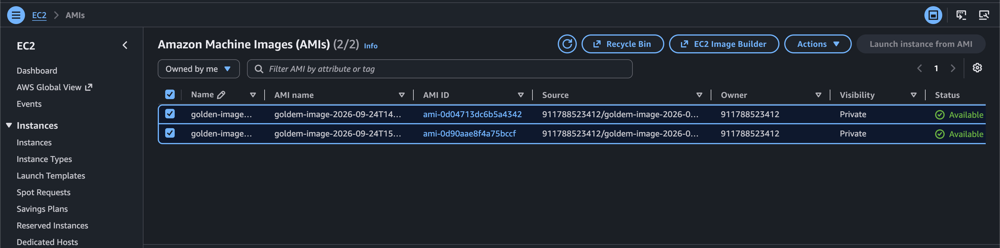
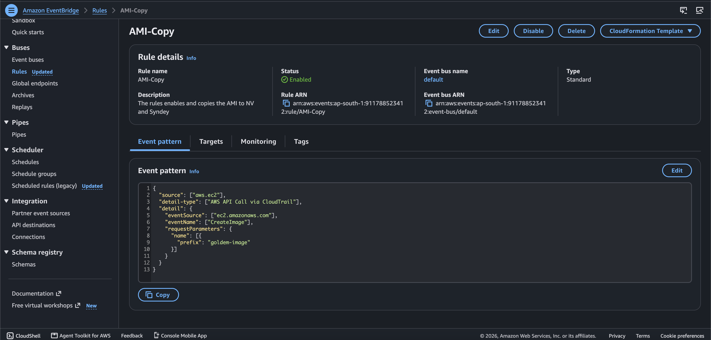
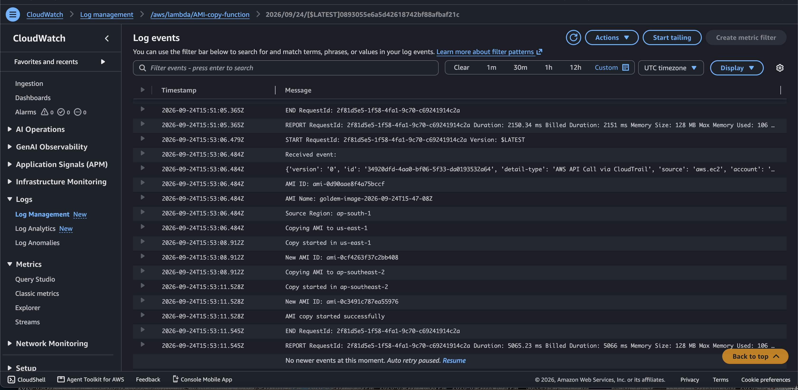
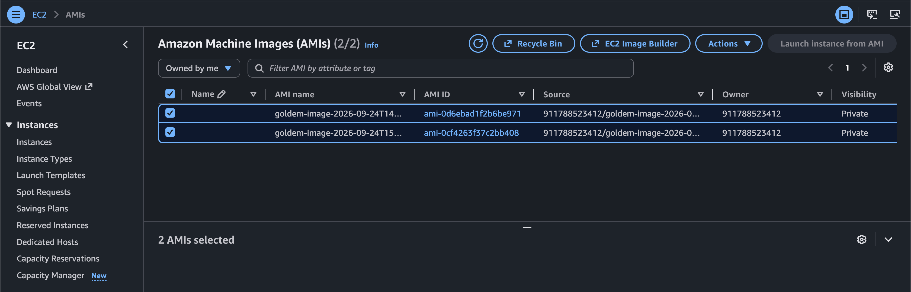
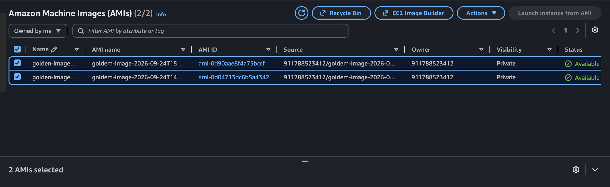

# 🚀 Day 11 – AWS Packer + Lambda Cross-Region AMI Automation

## 📌 Project Overview

In this hands-on project, I automated the creation of a customized AWS AMI using **HashiCorp Packer** and automated cross-region AMI copying using **Amazon EventBridge and AWS Lambda**.

The project was performed using a **Windows Server EC2 instance** as the Packer execution environment.

The automation flow was:

```text
Windows EC2
     ↓
Packer
     ↓
Temporary EC2
     ↓
Install & Configure Software
     ↓
Golden AMI in Mumbai
     ↓
CloudTrail
     ↓
EventBridge
     ↓
Lambda
     ↓
Copy AMI
   ↙     ↘
Virginia  Sydney
```

---

# 🏗️ Architecture


## Architecture Components

| Component      | Purpose                                      |
| -------------- | -------------------------------------------- |
| Windows EC2    | Environment used to run Packer               |
| Packer         | Automates AMI creation                       |
| Temporary EC2  | Instance created by Packer for customization |
| AMI            | Golden machine image                         |
| CloudTrail     | Records the `CreateImage` API event          |
| EventBridge    | Detects the matching CloudTrail event        |
| Lambda         | Copies the AMI to other AWS Regions          |
| us-east-1      | Destination Region – North Virginia          |
| ap-southeast-2 | Destination Region – Sydney                  |

---

# 🔄 Complete End-to-End Flow

```text
1. Windows EC2
       ↓
2. Install AWS CLI + Git + Git Bash + VS Code + Packer + Python
       ↓
3. Clone Packer project
       ↓
4. Configure packer-vars.json
       ↓
5. Run Packer Inspect
       ↓
6. Run Packer Validate
       ↓
7. Run Packer Build
       ↓
8. Packer launches temporary EC2
       ↓
9. Install NGINX, Git, Docker and required files
       ↓
10. Create Golden AMI in Mumbai
       ↓
11. CloudTrail records CreateImage API event
       ↓
12. EventBridge matches CreateImage event
       ↓
13. EventBridge triggers Lambda
       ↓
14. Lambda extracts AMI ID
       ↓
15. Lambda copies AMI to us-east-1
       ↓
16. Lambda copies AMI to ap-southeast-2
       ↓
17. Verify AMIs in Virginia and Sydney
```

---

# 🪟 Step 1 – Create Windows EC2

I used a Windows Server EC2 instance as the machine from which Packer was executed.

The Windows EC2 was used only as the Packer execution environment.

The Packer-created temporary EC2 was a separate instance.

---

# 🛠️ Step 2 – Install Required Tools

Inside the Windows EC2, I installed:

* Visual Studio Code
* AWS CLI
* Git
* Git Bash
* HashiCorp Packer
* Python

Versions used during the lab included:

```text
AWS CLI
Git
Packer
Python
```

AWS CLI authentication was verified with:

```bash
aws sts get-caller-identity
```

This confirmed that the AWS CLI could communicate with AWS.

---

# 📂 Step 3 – Clone the Packer Project

I cloned the Packer project into the Windows EC2 environment.

The project contained:

```text
packer/
├── README.md
├── docker.service
├── packer-vars.json
└── packer.json
```

---

# ⚙️ Step 4 – Configure Packer Variables

The Packer variables were configured in:

```text
packer-vars.json
```

The important values included:

```text
Region:
ap-south-1

Instance Type:
t3.micro

Source AMI:
Ubuntu AMI

VPC:
lambda-ami-vpc

Subnet:
Packer source subnet
```

AWS credentials were not stored as real credentials in the GitHub project.

---

# 🔎 Step 5 – Packer Inspect

Before running the build, I inspected the Packer configuration.

Command:

```bash
packer.exe inspect -var-file="packer-vars.json" packer.json
```

### Purpose

`packer inspect` helps inspect the Packer template and understand the configuration being used.

---

# ✅ Step 6 – Packer Validate

I validated the Packer configuration before starting the build.

Command:

```bash
packer.exe validate -var-file="packer-vars.json" packer.json
```

The configuration returned successfully as valid.

### Purpose

`packer validate` checks whether the Packer configuration is syntactically and structurally valid before building.

---

# 🚀 Step 7 – Run Packer Build

After inspection and validation, I started the AMI build.

Command:

```bash
packer.exe build -var-file="packer-vars.json" packer.json
```

Packer then started the AMI creation process.

---

# 🖥️ Step 8 – Packer Creates Temporary EC2

Packer launched a temporary EC2 instance in the Mumbai Region.

The temporary instance was used to:

* Install software
* Configure the machine
* Copy required files
* Prepare the machine image

The temporary EC2 was not my Windows EC2.

After the AMI was created, Packer automatically terminated the temporary instance.

---

# 📦 Step 9 – Install and Configure Software

During provisioning, Packer configured the temporary EC2.

The provisioning included:

* NGINX
* Git
* Docker
* Docker service configuration
* Required application/configuration files

The goal was to create a reusable customized machine image.

---

# 🖼️ Step 10 – Create Golden AMI

After provisioning was completed, Packer created the Golden AMI.

The AMI was created in:

```text
AWS Region:
ap-south-1
Mumbai
```

The AMI name used in this project started with:

```text
goldem-image
```

Example:

```text
goldem-image-2026-09-24T14-27-22Z
```

> Note: `goldem-image` is the actual spelling used in the Packer configuration for this project.

---

# 📸 Screenshot 01 – Packer Build Success



This screenshot shows the successful Packer build and AMI creation.

---

# 📸 Screenshot 02 – Source AMI in Mumbai



This screenshot shows the Golden AMI created in:

```text
ap-south-1
Mumbai
```

---

# 🛠️ Troubleshooting 1 – Temporary EC2 Network Problem

## Problem

During the Packer build, the temporary EC2 did not have proper internet access.

The provisioning process needed internet access to install packages and software.

## Root Cause

The subnet used by Packer did not automatically assign a public IPv4 address to newly launched instances.

The subnet setting was:

```text
Auto-assign public IPv4 address:
Disabled
```

## Fix

I enabled automatic public IPv4 assignment on the subnet.

Command:

```bash
aws ec2 modify-subnet-attribute \
--region ap-south-1 \
--subnet-id subnet-0ee576e4afc659eb7 \
--map-public-ip-on-launch
```

After changing the subnet configuration, I ran the Packer build again.

## Result

The temporary EC2 received the required network access and the Packer build completed successfully.

---

# ☁️ Step 11 – CloudTrail Records AMI Creation

When Packer created the AMI, AWS generated the:

```text
CreateImage
```

API event.

Amazon CloudTrail recorded this AWS API activity.

Flow:

```text
Packer
   ↓
EC2 CreateImage API
   ↓
CloudTrail
```

The important event was:

```text
eventName:
CreateImage
```

---

# ⚡ Step 12 – Configure EventBridge

I created an Amazon EventBridge rule named:

```text
AMI-Copy
```

The rule was created in:

```text
ap-south-1
Mumbai
```

The EventBridge rule listens for the CloudTrail `CreateImage` event.

---

# 📋 Step 13 – EventBridge Event Pattern

The EventBridge event pattern used was:

```json
{
  "source": ["aws.ec2"],
  "detail-type": ["AWS API Call via CloudTrail"],
  "detail": {
    "eventSource": ["ec2.amazonaws.com"],
    "eventName": ["CreateImage"],
    "requestParameters": {
      "name": [
        {
          "prefix": "goldem-image"
        }
      ]
    }
  }
}
```

The important condition is:

```text
eventName = CreateImage
```

and:

```text
AMI name prefix = goldem-image
```

---

# 📸 Screenshot 03 – EventBridge Event Pattern



This screenshot shows the EventBridge event pattern.

---

# 🛠️ Troubleshooting 2 – EventBridge Prefix Mismatch

## Problem

The EventBridge rule was initially configured with:

```text
golden-image
```

But the actual Packer AMI name was:

```text
goldem-image
```

Therefore, EventBridge did not match the `CreateImage` event.

## Root Cause

There was a spelling mismatch:

```text
EventBridge:
golden-image

Packer:
goldem-image
```

## Fix

I changed the EventBridge prefix from:

```text
golden-image
```

to:

```text
goldem-image
```

## Result

EventBridge successfully matched the AMI creation event and triggered Lambda.

---

# λ Step 14 – Create Lambda Function

I created a Lambda function:

```text
AMI-copy-function
```

Runtime:

```text
Python
```

The Lambda function was created in:

```text
ap-south-1
Mumbai
```

The Lambda execution role was:

```text
AMI-Copy-Lambda
```

---

# 🧑‍💻 Step 15 – Lambda Function Code

The Lambda function receives the EventBridge event and extracts:

* AMI ID
* AMI name
* Source Region

It then copies the AMI to the destination Regions.

```python
import boto3

target_regions = ["us-east-1", "ap-southeast-2"]


def lambda_handler(event, context):

    print("Received event:")
    print(event)

    ami_id = event["detail"]["responseElements"]["imageId"]
    ami_name = event["detail"]["requestParameters"]["name"]
    source_region = event["region"]

    print(f"AMI ID: {ami_id}")
    print(f"AMI Name: {ami_name}")
    print(f"Source Region: {source_region}")

    if "goldem-image" not in ami_name:
        print("Not target AMI")
        return "Not target AMI"

    for region in target_regions:

        print(f"Copying AMI to {region}")

        ec2 = boto3.client(
            "ec2",
            region_name=region
        )

        response = ec2.copy_image(
            SourceRegion=source_region,
            SourceImageId=ami_id,
            Name=f"{ami_name}-copy-{region}"
        )

        print(f"Copy started in {region}")
        print(f"New AMI ID: {response['ImageId']}")

    print("AMI copy started successfully")

    return "AMI copy started successfully"
```

The same code is available in:

```text
lambda_function.py
```

---

# 🧪 Step 16 – Test Lambda Manually

Before testing the complete automation, I manually tested the Lambda function with a sample CloudTrail-style event.

The test event contained:

```text
eventName:
CreateImage

AMI Name:
goldem-image-2026-09-24T14-27-22Z

AMI ID:
ami-0d04713dc6b5a4342

Source Region:
ap-south-1
```

Lambda successfully started AMI copies to:

```text
us-east-1
ap-southeast-2
```

This confirmed that the Lambda cross-region copy logic was working.

---

# 🛠️ Troubleshooting 3 – Lambda Timeout

## Problem

The Lambda function initially had a short timeout.

The function performs AMI copy operations to multiple Regions.

## Fix

I increased the Lambda timeout to approximately:

```text
1 minute
```

## Result

Lambda successfully started the AMI copy operations.

---

# ⚡ Step 17 – EventBridge Triggers Lambda Automatically

After correcting the EventBridge rule, I ran the Packer build again.

The automatic flow was:

```text
Packer
   ↓
CreateImage
   ↓
CloudTrail
   ↓
EventBridge
   ↓
Lambda
```

No manual Lambda invocation was required for the final automation test.

---

# 📸 Screenshot 04 – Lambda Automatic AMI Copy



This screenshot shows the Lambda execution and automatic AMI copy operation.

---

# 🌎 Step 18 – AMI Copy to North Virginia

Lambda copied the source AMI from:

```text
ap-south-1
```

to:

```text
us-east-1
North Virginia
```

The copied AMI became available in the destination Region.

---

# 📸 Screenshot 05 – AMI Copy in Virginia



This screenshot shows the AMI copy in:

```text
us-east-1
```

---

# 🌏 Step 19 – AMI Copy to Sydney

Lambda also copied the source AMI from:

```text
ap-south-1
```

to:

```text
ap-southeast-2
Sydney
```

The copied AMI became available in the destination Region.

---

# 📸 Screenshot 06 – AMI Copy in Sydney



This screenshot shows the AMI copy in:

```text
ap-southeast-2
```

---

# 🔁 Final Automated Architecture Flow

```text
                    WINDOWS EC2
                         │
                         │ Run Packer
                         ▼
                   HASHICORP PACKER
                         │
                         ▼
                 TEMPORARY EC2
                         │
              ┌──────────┼──────────┐
              │          │          │
            NGINX       GIT       DOCKER
              │          │          │
              └──────────┼──────────┘
                         │
                         ▼
                    GOLDEN AMI
                    ap-south-1
                         │
                         │ CreateImage
                         ▼
                    CLOUDTRAIL
                         │
                         ▼
                   EVENTBRIDGE
                         │
                         │ Event Match
                         ▼
                      LAMBDA
                         │
                 ┌───────┴────────┐
                 │                │
                 ▼                ▼
             us-east-1       ap-southeast-2
             Virginia            Sydney
                 │                │
                 ▼                ▼
              AMI COPY         AMI COPY
```

---

# 📂 Project Structure

```text
Day-11-AWS-PACKER-LAMBDA-AMI-AUTOMATION/
│
├── architecture.png
│
├── 01-Packer-Build-Success.png
├── 02-Source-AMI-Mumbai.png
├── 03-EventBridge-Event-Pattern.png
├── 04-Lambda-Automatic-Copy.png
├── 05-AMI-Copy-Virginia.png
├── 06-AMI-Copy-Sydney.png
│
├── packer.json
├── packer-vars.json
├── docker.service
├── lambda_function.py
└── eventbridge-pattern.json
```

---

# 📝 Important Files

### `packer.json`

Contains the Packer configuration used to build the AMI.

### `packer-vars.json`

Contains Packer variables such as:

* AWS Region
* Source AMI
* Instance type
* VPC
* Subnet

Credentials are kept as placeholders and are not stored as real secrets.

### `lambda_function.py`

Contains the Lambda logic used to copy the AMI across Regions.

### `eventbridge-pattern.json`

Contains the EventBridge event matching pattern.

### `docker.service`

Docker service configuration used during the Packer provisioning process.

---

# 🛠️ Commands Used

## Check AWS Identity

```bash
aws sts get-caller-identity
```

## Inspect Packer

```bash
packer.exe inspect -var-file="packer-vars.json" packer.json
```

## Validate Packer

```bash
packer.exe validate -var-file="packer-vars.json" packer.json
```

## Build AMI

```bash
packer.exe build -var-file="packer-vars.json" packer.json
```

## Fix Subnet Public IPv4 Assignment

```bash
aws ec2 modify-subnet-attribute \
--region ap-south-1 \
--subnet-id subnet-0ee576e4afc659eb7 \
--map-public-ip-on-launch
```

---

# 🎯 What I Learned

### Packer

Packer automates machine-image creation.

```text
Packer
   ↓
Temporary EC2
   ↓
Install & Configure
   ↓
AMI
```

### CloudTrail

CloudTrail records AWS API activity.

```text
CreateImage
     ↓
CloudTrail
```

### EventBridge

EventBridge matches the required event and triggers the target.

```text
CloudTrail Event
       ↓
EventBridge Rule
       ↓
Lambda
```

### Lambda

Lambda performs the AMI copy operation.

```text
Lambda
 ├── us-east-1
 └── ap-southeast-2
```

---

# ⭐ Final Result

Successfully implemented an automated AMI creation and cross-region AMI copy workflow.

```text
Packer
  ↓
Golden AMI
  ↓
CloudTrail
  ↓
EventBridge
  ↓
Lambda
  ↓
┌─────────────────┐
│                 │
▼                 ▼
Virginia         Sydney
```

The project demonstrates how **Packer, CloudTrail, EventBridge, Lambda and EC2 AMIs** can work together to automate machine-image creation and multi-region distribution.

