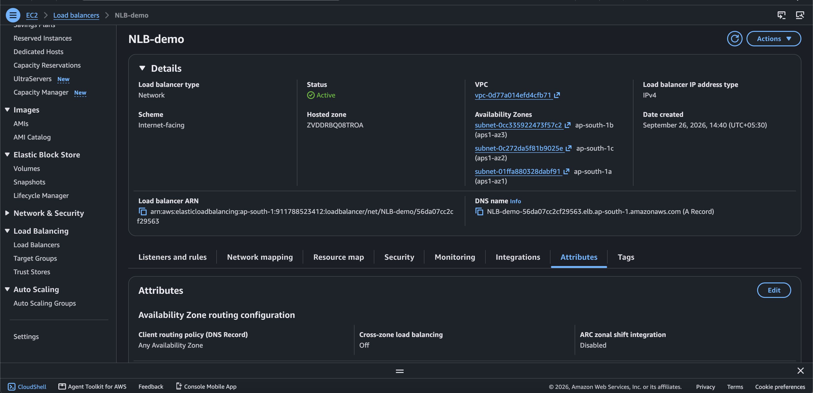
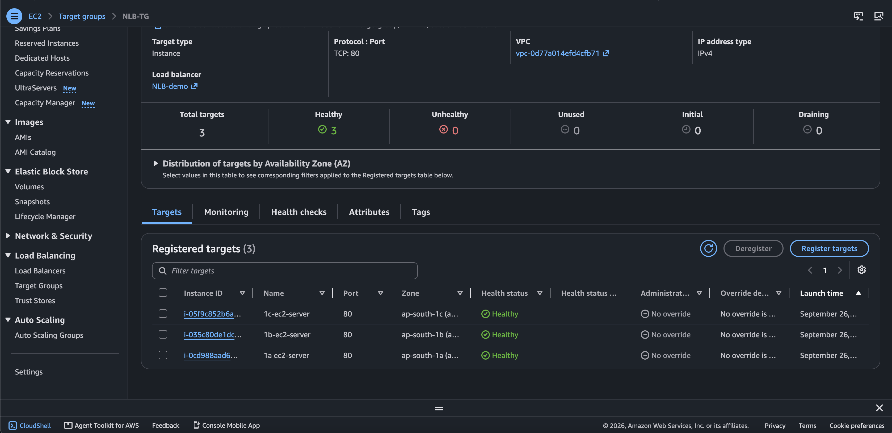
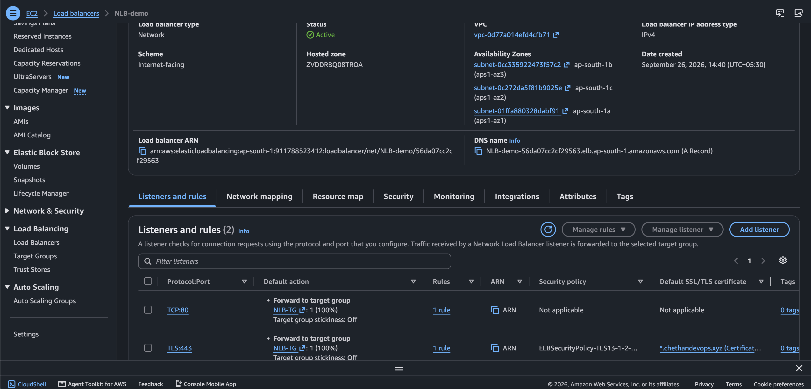
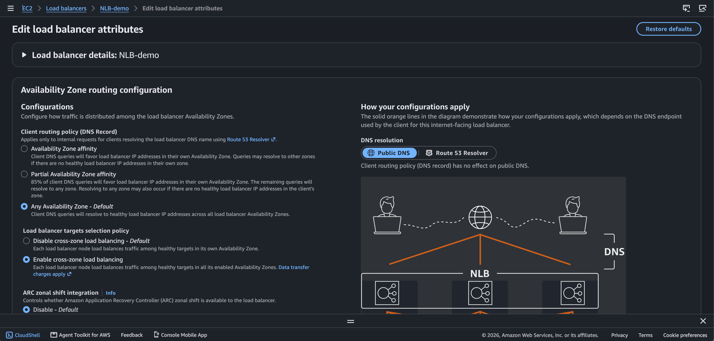
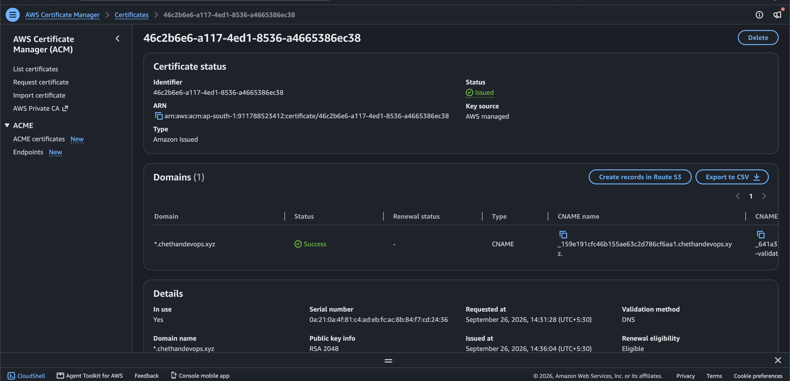
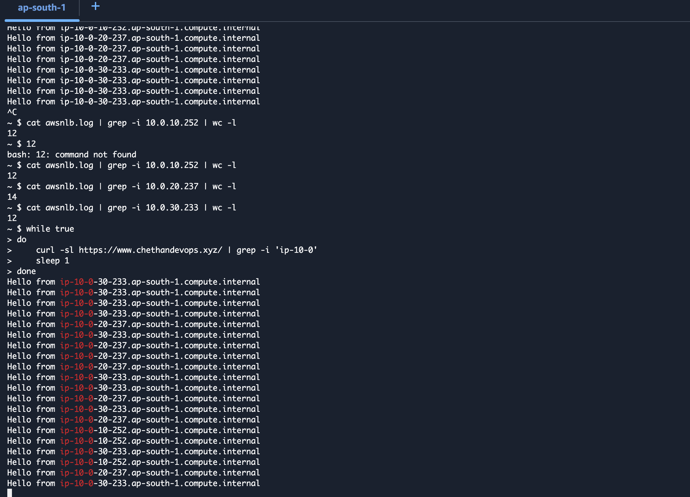
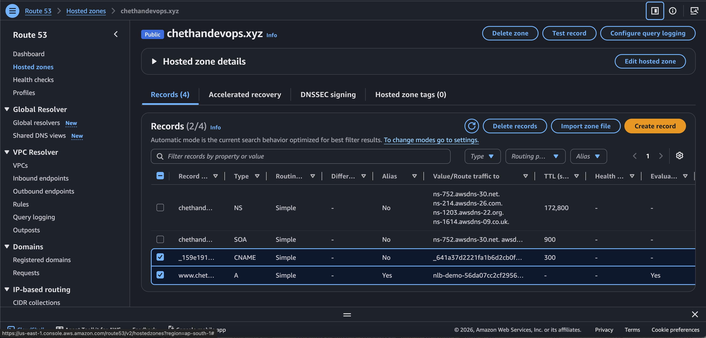

# 🚀 Day 12 — AWS Network Load Balancer (NLB) Hands-On

## 📌 Project Overview

This project demonstrates a hands-on implementation of an **AWS Network Load Balancer (NLB)** using multiple private EC2 instances running NGINX.

The NLB receives HTTPS traffic through a Route 53 domain and forwards the traffic to healthy backend EC2 instances located in different Availability Zones.

---

# 🏗️ Architecture

## 🖼️ Architecture Image


## 🔄 Architecture Flow

```text
                         Internet
                            │
                            │ HTTPS :443
                            ▼
                    ┌─────────────────┐
                    │    Route 53     │
                    │   DNS Record    │
                    └────────┬────────┘
                             │
                             ▼
                    ┌─────────────────┐
                    │ Internet-Facing │
                    │       NLB       │
                    └────────┬────────┘
                             │
                    ┌────────┴────────┐
                    │                 │
                 TLS :443          TCP :80
                    │                 │
                    └────────┬────────┘
                             │
                             ▼
                    ┌─────────────────┐
                    │   Target Group  │
                    │     HTTP :80    │
                    └────────┬────────┘
                             │
             ┌───────────────┼───────────────┐
             │               │               │
             ▼               ▼               ▼
       ┌───────────┐   ┌───────────┐   ┌───────────┐
       │ Private   │   │ Private   │   │ Private   │
       │ EC2 1A    │   │ EC2 1B    │   │ EC2 1C    │
       │ :80       │   │ :80       │   │ :80       │
       │ NGINX     │   │ NGINX     │   │ NGINX     │
       └───────────┘   └───────────┘   └───────────┘
```

## 🌐 Traffic Flow

```text
Client
  ↓
HTTPS Request
  ↓
Route 53
  ↓
Internet-Facing NLB
  ↓
TLS :443 Listener
  ↓
Target Group
  ↓
Healthy Private EC2
  ↓
NGINX :80
  ↓
Response
```

---

# ☁️ AWS Services Used

* Amazon VPC
* Amazon EC2
* Network Load Balancer (NLB)
* Target Groups
* AWS Certificate Manager (ACM)
* Amazon Route 53
* NAT Gateway
* Security Groups
* NGINX
* Ubuntu

---

# 🌐 VPC Configuration

The NLB lab was created inside a custom VPC.

```text
VPC CIDR: 10.0.0.0/16
```

## Public Subnets

```text
10.0.1.0/24
10.0.2.0/24
10.0.3.0/24
```

The public subnets were used for the internet-facing NLB and the temporary public test server.

## Private Subnets

```text
10.0.10.0/24
10.0.20.0/24
10.0.30.0/24
```

The backend EC2 instances were placed in private subnets.

---

# 🖥️ Backend EC2 Instances

Three private EC2 instances were used as NLB targets.

| Availability Zone | Instance        | Private IP    |
| ----------------- | --------------- | ------------- |
| AZ-1A             | `1a-ec2-server` | `10.0.10.252` |
| AZ-1B             | `1b-ec2-server` | `10.0.20.237` |
| AZ-1C             | `1c-ec2-server` | `10.0.30.x`   |

Each backend server runs NGINX on port `80`.

> The exact private IP of the AZ-1C instance is not documented rather than guessing it.

---

# 📝 EC2 User Data

The following **User Data script** was used while launching the private EC2 backend instances.

```bash
#!/bin/bash

apt update
apt install -y nginx

systemctl start nginx
systemctl enable nginx

echo "Hello from $(hostname -f)" > /var/www/html/index.nginx-debian.html
```

## What the Script Does

```text
EC2 Launch
    ↓
User Data executes
    ↓
apt update
    ↓
Install NGINX
    ↓
Start NGINX
    ↓
Enable NGINX
    ↓
Create Custom HTML Response
```

The following command creates a custom response containing the EC2 hostname:

```bash
echo "Hello from $(hostname -f)" > /var/www/html/index.nginx-debian.html
```

Example:

```text
Hello from ip-10-0-10-252.ap-south-1.compute.internal
```

The hostname helps identify which backend EC2 instance processed the request.

---

# 🔐 Connect to Private EC2 Through Public EC2

Because the backend EC2 instances were private, a public EC2 instance was used as a temporary jump server.

## Step 1 — Connect from Mac to Public EC2

```bash
ssh -i "/Users/sushma/Documents/Lambda-ami-key.pem" ubuntu@43.205.215.233
```

## Step 2 — Connect from Public EC2 to Private EC2

```bash
ssh -i /home/ubuntu/pem.key ubuntu@10.0.10.252
```

For the second private EC2:

```bash
ssh -i /home/ubuntu/pem.key ubuntu@10.0.20.237
```

---

# 🔑 NGINX Verification Commands

After connecting to a private EC2 instance, NGINX was verified using:

```bash
sudo systemctl status nginx
```

Check the web root:

```bash
ls /var/www/html
```

Check the NGINX response:

```bash
cat /var/www/html/index.nginx-debian.html
```

Example response:

```text
Hello from ip-10-0-10-252.ap-south-1.compute.internal
```

---

# 🌍 NAT Gateway Configuration

The private EC2 instances needed outbound internet connectivity during setup so that packages such as NGINX could be installed.

The private subnet route table was configured with:

```text
Destination        Target
10.0.0.0/16        local
0.0.0.0/0          NAT Gateway
```

## NAT Gateway Traffic Flow

```text
Private EC2
    ↓
Private Route Table
    ↓
NAT Gateway
    ↓
Internet Gateway
    ↓
Internet
```

The NAT Gateway provides **outbound internet connectivity** for private EC2 instances.

It does not make the private EC2 instances directly accessible from the internet.

---

# 🧪 NAT Connectivity Test

After configuring the private route table, outbound connectivity was tested using:

```bash
curl -4 -I https://archive.ubuntu.com
```

The request returned an HTTP success response:

```text
HTTP/1.1 200 OK
```

This confirmed that the private EC2 instance could reach the internet through the NAT Gateway.

---

# 🎯 Target Group

A Target Group was created for the private backend EC2 instances.

## Target Group Configuration

```text
Target Type: Instances
Protocol: HTTP
Port: 80
```

The private EC2 instances were registered as targets.

```text
                 Target Group
                      │
          ┌───────────┼───────────┐
          │           │           │
          ▼           ▼           ▼
        EC2 1A      EC2 1B      EC2 1C
        HTTP :80    HTTP :80    HTTP :80
```

---

# ❤️ Target Group Health Check

The target group health check was configured using:

```text
Protocol: HTTP
Port: 80
```

The NLB uses health checks to determine whether backend targets are healthy.

Only healthy targets are used for normal traffic forwarding.

The target group was verified with healthy backend targets.

---

# ⚖️ Network Load Balancer

An **Internet-facing Network Load Balancer** was created.

## NLB Configuration

```text
Scheme: Internet-facing
Load Balancer Type: Network Load Balancer
```

The NLB was associated with public subnets across multiple Availability Zones.

## NLB Traffic Flow

```text
Internet
   ↓
Internet-Facing NLB
   ↓
Listener
   ↓
Target Group
   ↓
Private EC2
   ↓
NGINX :80
```

---

# 👂 NLB Listeners

Two listeners were configured.

## TCP Listener — Port 80

```text
TCP :80
    ↓
Forward
    ↓
Target Group
```

## TLS Listener — Port 443

```text
TLS :443
    ↓
Forward
    ↓
Target Group
```

Therefore:

```text
TCP :80  → Target Group
TLS :443 → Target Group
```

---

# 🔒 AWS Certificate Manager (ACM)

AWS Certificate Manager was used to provide the SSL/TLS certificate for the NLB TLS listener.

The certificate was attached to the TLS listener on port `443`.

## TLS Traffic Flow

```text
Client
   │
   │ HTTPS :443
   ▼
NLB TLS Listener
   │
   │ ACM Certificate
   ▼
Target Group
   │
   │ HTTP :80
   ▼
Private EC2
   │
   ▼
NGINX
```

In this setup, TLS is terminated at the NLB.

The backend NGINX servers continue to receive HTTP traffic on port `80`.

---

# 🌐 Route 53 DNS

Route 53 was used to provide DNS resolution for the application domain.

The domain was configured to reach the NLB.

The application was tested using:

```text
https://www.chethandevops.xyz/
```

## DNS Traffic Flow

```text
User
 ↓
www.chethandevops.xyz
 ↓
Route 53
 ↓
NLB
 ↓
Target Group
 ↓
Private EC2
```

---

# 🔄 Cross-Zone Load Balancing

Cross-Zone Load Balancing was enabled for the NLB.

This allows traffic to be distributed across targets in different Availability Zones.

```text
                       NLB
                        │
          ┌─────────────┼─────────────┐
          ▼             ▼             ▼
        AZ-1A         AZ-1B         AZ-1C
          │             │             │
         EC2           EC2           EC2
```

Cross-Zone Load Balancing is separate from target group stickiness.

A small smoke test should not be interpreted as proof that every backend receives exactly the same number of requests.

---

# 🧪 HTTPS NLB Traffic Test

The NLB was tested using the HTTPS domain.

## Single Request

```bash
curl -sl https://www.chethandevops.xyz/ | grep -i 'ip-10-0'
```

## Continuous Request Test

```bash
while true
do
    curl -sl https://www.chethandevops.xyz/ | grep -i 'ip-10-0'
    sleep 1
done
```

This continuously sends HTTPS requests through the NLB.

To stop the loop:

```text
Ctrl + C
```

---

# 📊 Test Result

The HTTPS test returned responses containing different backend EC2 hostnames.

Example:

```text
Hello from ip-10-0-30-xxx.ap-south-1.compute.internal
Hello from ip-10-0-20-237.ap-south-1.compute.internal
Hello from ip-10-0-10-252.ap-south-1.compute.internal
```

This demonstrated that HTTPS requests sent to the NLB were being forwarded to multiple healthy private EC2 targets running NGINX.

The backend hostname in the response made it possible to identify which private EC2 processed the request.

---

# 🛠️ Troubleshooting

## Issue 1 — Private EC2 Could Not Install NGINX

Initially, the private EC2 instance did not have working outbound internet connectivity.

The cloud-init output was checked using:

```bash
cat /var/log/cloud-init-output.log
```

The installation was failing because the private instance could not reach the Ubuntu package repository.

## Solution

The private subnet route table was updated with:

```text
0.0.0.0/0 → NAT Gateway
```

After the route was added, connectivity was tested:

```bash
curl -4 -I https://archive.ubuntu.com
```

The request returned:

```text
HTTP/1.1 200 OK
```

NGINX installation could then complete successfully.

---

# 🧠 Important NLB Concepts Learned

## 1. NLB is Layer 4

NLB operates at **Layer 4** of the OSI model.

It supports:

```text
TCP
UDP
TLS
```

---

## 2. NLB vs ALB

```text
NLB
Layer 4
TCP / UDP / TLS
Connection-based load balancing
```

```text
ALB
Layer 7
HTTP / HTTPS
Host-based routing
Path-based routing
```

For example, ALB can route:

```text
example.com/api
        ↓
API Target Group
```

and:

```text
example.com/images
        ↓
Images Target Group
```

NLB does not provide ALB-style HTTP path-based routing.

---

# 🔐 Why Use Private EC2 Targets?

The backend EC2 instances do not need public IP addresses.

Instead:

```text
Internet
   ↓
NLB
   ↓
Private EC2
```

This keeps the backend instances private while allowing them to receive application traffic through the load balancer.

---

# 🔄 Complete End-to-End Flow

```text
                         INTERNET
                            │
                            │ HTTPS :443
                            ▼
                    ┌─────────────────┐
                    │    Route 53     │
                    │      DNS        │
                    └────────┬────────┘
                             │
                             ▼
                    ┌─────────────────┐
                    │ Internet-Facing │
                    │      NLB        │
                    └────────┬────────┘
                             │
                         TLS :443
                             │
                             ▼
                    ┌─────────────────┐
                    │   Target Group  │
                    │    HTTP :80     │
                    └────────┬────────┘
                             │
               ┌─────────────┼─────────────┐
               ▼             ▼             ▼
           Private EC2   Private EC2   Private EC2
              AZ-1A         AZ-1B         AZ-1C
               │             │             │
               ▼             ▼             ▼
             NGINX         NGINX         NGINX
              :80           :80           :80
               │             │             │
               └─────────────┼─────────────┘
                             │
                             ▼
                          Response
```

---

# 📸 Screenshots

## 1. NLB Overview



---

## 2. Target Group — Healthy Targets



---

## 3. NLB Listeners — TCP 80 and TLS 443



---

## 4. Cross-Zone Load Balancing



---

## 5. ACM Certificate



---

## 6. NLB Traffic Test — Multiple Private Targets



---

## 7. Route 53 DNS Record



---

# 📁 Project Structure

```text
Day-12-AWS-NETWORK-LOAD-BALANCER/
│
├── README.md
├── architecture.png
│
└── screenshots/
    ├── 01-NLB-Overview.png
    ├── 02-NLB-Target-Group-Healthy-Targets.png
    ├── 03-NLB-Listeners-TCP80-TLS443.png
    ├── 04-NLB-Cross-Zone-Load-Balancing.png
    ├── 05-NLB-ACM-Certificate.png
    ├── 06-NLB-Traffic-Test-Multiple-Private-Targets.png
    └── 07-Route53-DNS-Record-NLB.png
```

---

# 📚 Key Learnings

Through this hands-on project, I practiced:

* Creating and configuring a VPC
* Working with public and private subnets
* Configuring route tables
* Using a NAT Gateway for private outbound connectivity
* Launching private EC2 instances
* Installing and configuring NGINX
* Using EC2 User Data
* Creating Target Groups
* Configuring health checks
* Creating an Internet-facing Network Load Balancer
* Configuring TCP listeners
* Configuring TLS listeners
* Using ACM certificates
* Configuring Route 53 DNS
* Enabling Cross-Zone Load Balancing
* Testing HTTPS traffic
* Verifying traffic reaching multiple private backend targets
* Troubleshooting private subnet connectivity

---

# 🧹 Cleanup

After completing the hands-on testing, the NLB and target group created for this lab were deleted.

Temporary resources created specifically for this lab were reviewed and cleaned up where appropriate.

Resources belonging to other environments or users were left unchanged.

---

# 🎯 Project Outcome

Successfully completed a hands-on **AWS Network Load Balancer** implementation with:

```text
Route 53
    ↓
Internet-Facing NLB
    ↓
TLS :443 / TCP :80
    ↓
Target Group
    ↓
Multiple Private EC2 Instances
    ↓
NGINX :80
```

The HTTPS traffic test successfully showed responses from multiple private backend EC2 instances, demonstrating NLB traffic forwarding across healthy targets.

